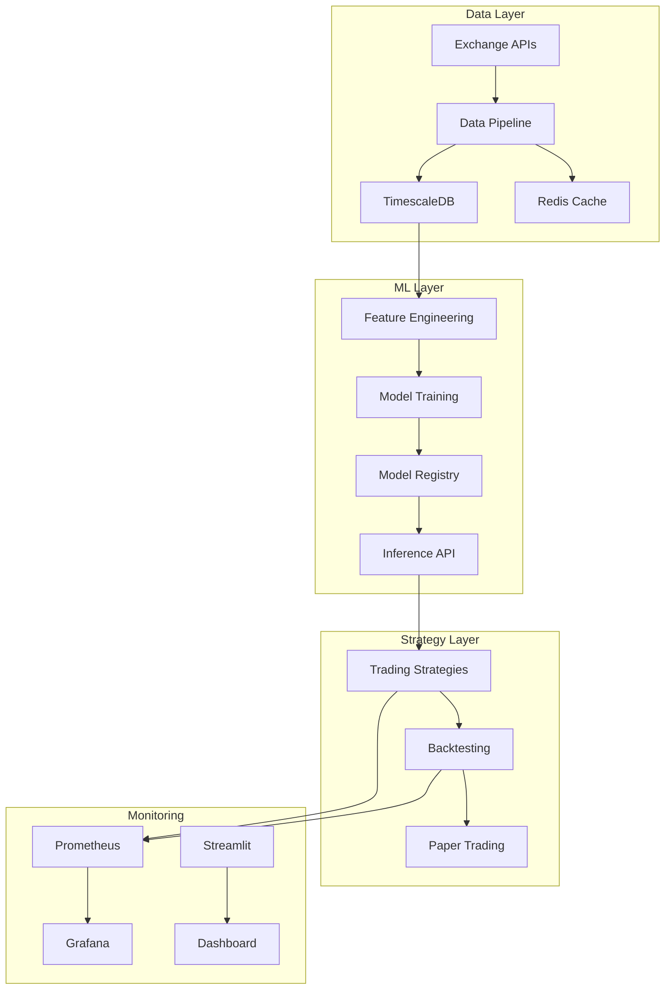

# Algorithmic Trading ML Platform

[](https://python.org)
[](https://fastapi.tiangolo.com)
[](https://mlflow.org)
[](https://docker.com)
[](LICENSE)
[](https://github.com/NikVince/algorithmic-trading-ml-platform)
[](https://github.com/NikVince/algorithmic-trading-ml-platform)

> **A production-grade algorithmic trading system showcasing ML Engineering and MLOps skills for portfolio/internship applications.**

## 🚀 Overview

This project demonstrates advanced ML Engineering and MLOps capabilities through a comprehensive algorithmic trading platform. Built with production-grade architecture, it showcases expertise in feature engineering, model training pipelines, inference serving, and real-time trading systems.

### 🎯 Key Features

- **🔄 Real-time Data Pipeline**: Multi-exchange data ingestion with quality monitoring
- **🧠 Advanced ML Pipeline**: LSTM, LightGBM, and ensemble models with MLOps
- **📊 Feature Engineering**: 50+ technical indicators with drift detection
- **⚡ High-Performance API**: Sub-10ms inference with FastAPI
- **📈 Backtesting Engine**: Realistic simulation with transaction costs
- **📊 Monitoring & Observability**: Comprehensive metrics and alerting
- **🔒 Production-Ready**: Docker, monitoring, and security best practices

### 🏗️ Architecture



## 🛠️ Tech Stack

### Core Technologies
- **Backend**: Python 3.11+, FastAPI, pandas, numpy
- **ML/MLOps**: scikit-learn, LightGBM, TensorFlow, MLflow, Optuna
- **Data**: ccxt, TimescaleDB, Redis
- **Backtesting**: vectorbt
- **Monitoring**: Prometheus, Grafana, Streamlit
- **Infrastructure**: Docker, Docker Compose

### Key Libraries
- **Data Processing**: pandas, numpy, ccxt
- **Machine Learning**: scikit-learn, LightGBM, TensorFlow
- **MLOps**: MLflow, Optuna
- **Time Series**: TimescaleDB, Redis
- **Backtesting**: vectorbt
- **Monitoring**: Prometheus, Grafana
- **API**: FastAPI, Pydantic
- **Visualization**: Streamlit, Plotly

## 🚀 Quick Start

### Prerequisites
- Docker 20.10+ with Docker Compose 2.0+
- Python 3.11+ (for local development)
- 8GB RAM minimum, 16GB recommended

### Installation

1. **Clone the repository**
   ```bash
   git clone https://github.com/NikVince/algorithmic-trading-ml-platform.git
   cd algorithmic-trading-ml-platform
   ```

2. **Set up environment**
   ```bash
   cp .env.example .env
   # Edit .env with your configuration
   ```

3. **Start services**
   ```bash
   docker-compose up -d
   ```

4. **Verify installation**
   ```bash
   curl http://localhost:8000/health
   ```

### Access Points
- **API**: http://localhost:8000
- **API Docs**: http://localhost:8000/docs
- **MLflow**: http://localhost:5000
- **Grafana**: http://localhost:3000
- **Dashboard**: http://localhost:8501

## 📊 Development Progress

### 🎯 Project Status
**Current Phase**: Phase 1 - Data Pipeline Foundation  
**Overall Progress**: 0% Complete  
**Last Updated**: October 2025

### 📋 Development Tracking

#### ✅ Completed Components

| Component | Status | Progress | Last Updated |
|-----------|--------|----------|--------------|
| **Project Planning** | ✅ Complete | 100% | Oct 2025 |
| **Documentation** | ✅ Complete | 100% | Oct 2025 |
| **Architecture Design** | ✅ Complete | 100% | Oct 2025 |

#### ⏳ Pending Components

| Component | Status | Progress | Last Updated |
|-----------|--------|----------|--------------|
| **Data Pipeline** | ⏳ Pending | 0% | - |
| **Development Environment** | ⏳ Pending | 0% | - |

#### ⏳ Pending Components

| Component | Status | Progress | Last Updated |
|-----------|--------|----------|--------------|
| **Feature Engineering** | ⏳ Pending | 0% | - |
| **Model Training** | ⏳ Pending | 0% | - |
| **Model Serving** | ⏳ Pending | 0% | - |
| **Trading Strategies** | ⏳ Pending | 0% | - |
| **Backtesting Engine** | ⏳ Pending | 0% | - |
| **Monitoring & Dashboard** | ⏳ Pending | 0% | - |
| **Integration & Testing** | ⏳ Pending | 0% | - |

### 🏗️ Component Breakdown

#### **Data Pipeline** (Phase 1)
- [ ] **Data Collector** - Multi-exchange data ingestion
- [ ] **Data Validator** - Quality checks and validation
- [ ] **Data Transformer** - Data preprocessing and enrichment
- [ ] **Storage Layer** - TimescaleDB and Redis setup
- [ ] **Quality Monitoring** - Data quality metrics and alerts

#### **Feature Engineering** (Phase 2)
- [ ] **Technical Indicators** - RSI, MACD, Bollinger Bands
- [ ] **Market Regime Detection** - Volatility and trend analysis
- [ ] **Cross-Asset Features** - Correlations and relative strength
- [ ] **Feature Store** - Feature caching and management
- [ ] **Drift Detection** - Feature drift monitoring

#### **Model Training** (Phase 3)
- [ ] **LSTM Models** - Deep learning for sequence prediction
- [ ] **LightGBM Models** - Gradient boosting for tabular data
- [ ] **Ensemble Models** - Multi-model combination strategies
- [ ] **MLflow Integration** - Experiment tracking and model registry
- [ ] **Walk-Forward Validation** - Time-series specific validation

#### **Model Serving** (Phase 4)
- [ ] **FastAPI Service** - High-performance inference API
- [ ] **Model Loading** - Efficient model loading and caching
- [ ] **Request Validation** - Input validation and error handling
- [ ] **Health Checks** - System health monitoring
- [ ] **Rate Limiting** - API rate limiting and authentication

#### **Trading Strategies** (Phase 5)
- [ ] **Strategy Framework** - Base class and plugin architecture
- [ ] **Momentum Strategies** - Trend-following implementations
- [ ] **ML-Based Strategies** - Model-driven trading strategies
- [ ] **Mean Reversion Strategies** - Contrarian trading approaches
- [ ] **Risk Management** - Position sizing and risk controls

#### **Backtesting Engine** (Phase 6)
- [ ] **vectorbt Integration** - Vectorized backtesting engine
- [ ] **Transaction Cost Modeling** - Realistic cost simulation
- [ ] **Slippage Simulation** - Market impact modeling
- [ ] **Walk-Forward Testing** - Rolling window validation
- [ ] **Performance Attribution** - Detailed performance analysis

#### **Monitoring & Dashboard** (Phase 7)
- [ ] **Prometheus Metrics** - System and business metrics
- [ ] **Grafana Dashboards** - Operational monitoring
- [ ] **Streamlit Dashboard** - Interactive performance analysis
- [ ] **Alert System** - Anomaly detection and alerting
- [ ] **Performance Analysis** - Comprehensive performance insights

#### **Integration & Testing** (Phase 8)
- [ ] **Docker Compose** - Complete orchestration
- [ ] **Integration Tests** - End-to-end testing
- [ ] **Load Testing** - Performance and scalability testing
- [ ] **Security Audit** - Security assessment and hardening
- [ ] **Documentation** - Complete documentation and guides

### 📈 Milestones

| Milestone | Target Date | Status | Progress |
|-----------|-------------|--------|----------|
| **Phase 1 Complete** | Nov 8, 2025 | ⏳ Pending | 0% |
| **Phase 2 Complete** | Nov 22, 2025 | ⏳ Pending | 0% |
| **Phase 3 Complete** | Dec 13, 2025 | ⏳ Pending | 0% |
| **Phase 4 Complete** | Dec 27, 2025 | ⏳ Pending | 0% |
| **Phase 5 Complete** | Jan 10, 2026 | ⏳ Pending | 0% |
| **Phase 6 Complete** | Jan 24, 2026 | ⏳ Pending | 0% |
| **Phase 7 Complete** | Feb 7, 2026 | ⏳ Pending | 0% |
| **Phase 8 Complete** | Feb 21, 2026 | ⏳ Pending | 0% |
| **MVP Complete** | Feb 21, 2026 | ⏳ Pending | 0% |

### 🎯 Current Sprint Goals

#### **Sprint 1 (Oct 25 - Nov 8, 2025): Data Pipeline Foundation**
- [ ] Set up Docker Compose with TimescaleDB + Redis
- [ ] Implement basic ccxt data collector
- [ ] Create data validation framework
- [ ] Set up basic monitoring dashboard
- [ ] Complete Phase 1 documentation

#### **Next Sprint Preview**
- [ ] Feature engineering pipeline
- [ ] Technical indicators library
- [ ] Feature store implementation
- [ ] Feature drift detection

## 📚 Documentation

### Core Documentation
- [**Architecture Overview**](docs/architecture.md) - System design and components
- [**API Reference**](docs/api_reference.md) - Complete API documentation
- [**Deployment Guide**](docs/deployment.md) - Setup and deployment instructions
- [**Development Plan**](docs/development_plan.md) - Detailed development roadmap

### Component Documentation
- [**Data Pipeline**](docs/components/data_pipeline.md) - Data ingestion and quality
- [**Feature Engineering**](docs/components/feature_engineering.md) - Feature creation and management
- [**Model Training**](docs/components/model_training.md) - ML pipeline and MLOps
- [**Model Serving**](docs/components/model_serving.md) - Inference API and deployment
- [**Trading Strategies**](docs/components/trading_strategies.md) - Strategy framework
- [**Backtesting**](docs/components/backtesting.md) - Backtesting engine and validation
- [**Monitoring**](docs/components/monitoring.md) - Observability and alerting

### Additional Resources
- [**Performance Analysis**](docs/performance.md) - Performance analysis framework
- [**Troubleshooting**](docs/troubleshooting.md) - Common issues and solutions

## 🧪 Testing

### Test Coverage
- **Unit Tests**: 90%+ coverage for business logic
- **Integration Tests**: End-to-end pipeline testing
- **Load Tests**: Performance and scalability testing
- **Security Tests**: Security vulnerability assessment

### Running Tests
```bash
# Run all tests
docker-compose exec api pytest

# Run specific test categories
docker-compose exec api pytest tests/unit/
docker-compose exec api pytest tests/integration/
docker-compose exec api pytest tests/load/
```

## 📊 Performance Metrics

### System Performance
- **API Response Time**: < 100ms (95th percentile)
- **Model Inference**: < 10ms
- **Data Ingestion**: < 1 second per batch
- **System Uptime**: > 99.9%

### Trading Performance
- **Sharpe Ratio**: > 1.5 (target)
- **Maximum Drawdown**: < 15% (target)
- **Win Rate**: > 55% (target)
- **Risk-Adjusted Returns**: > 20% annually (target)

## 🤝 Contributing

### Development Workflow
1. **Fork** the repository
2. **Create** a feature branch (`git checkout -b feature/amazing-feature`)
3. **Commit** your changes (`git commit -m 'Add amazing feature'`)
4. **Push** to the branch (`git push origin feature/amazing-feature`)
5. **Open** a Pull Request

### Code Standards
- **Python**: Follow PEP 8 style guide
- **Type Hints**: Use type hints for all functions
- **Documentation**: Document all public functions and classes
- **Testing**: Write tests for all new functionality
- **Logging**: Use structured logging with loguru

## 📄 License

This project is licensed under the MIT License - see the [LICENSE](LICENSE) file for details.

## 🙏 Acknowledgments

- **ccxt** - Cryptocurrency exchange API library
- **vectorbt** - Vectorized backtesting library
- **MLflow** - Machine learning lifecycle management
- **FastAPI** - High-performance API framework
- **TimescaleDB** - Time-series database
- **Prometheus** - Monitoring and alerting toolkit

## 📞 Support

- **Documentation**: Check the [docs](docs/) directory
- **Issues**: Report bugs via [GitHub Issues](https://github.com/NikVince/algorithmic-trading-ml-platform/issues)
- **Discussions**: Join discussions via [GitHub Discussions](https://github.com/NikVince/algorithmic-trading-ml-platform/discussions)

---

**Built with ❤️ for ML Engineering and MLOps excellence**