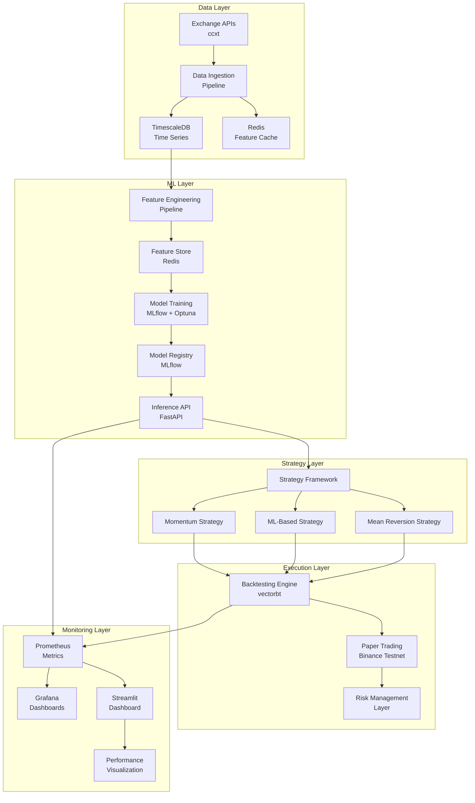

# System Architecture Overview

## 🏗️ High-Level Architecture

The Algorithmic Trading ML Platform is a production-grade system designed to demonstrate ML Engineering and MLOps capabilities. The architecture follows microservices principles with clear separation of concerns.



## 🔧 Core Components

### 1. Data Pipeline (`src/data/`)

**Purpose**: Reliable data ingestion, validation, and storage for cryptocurrency markets.

**Key Features**:
- Multi-exchange data aggregation via ccxt
- Real-time data validation and quality checks
- Time-series optimized storage with TimescaleDB
- Feature caching with Redis for low-latency access

**Architecture**:
```
Data Sources → Validation → Transformation → Storage → Cache
```

**Technologies**:
- **ccxt**: Exchange API abstraction
- **TimescaleDB**: Time-series database
- **Redis**: Feature caching and session storage
- **pandas**: Data manipulation and validation

### 2. Feature Engineering (`src/features/`)

**Purpose**: Production-grade feature engineering pipeline with drift detection and validation.

**Key Features**:
- 50+ technical indicators and market regime features
- Real-time feature computation with caching
- Feature drift detection and monitoring
- Modular, testable feature pipeline

**Feature Categories**:
- **Technical Indicators**: RSI, MACD, Bollinger Bands, ADX
- **Market Regime**: Volatility regimes, trend detection
- **Cross-Asset**: Correlations, relative strength
- **Custom Features**: ML-derived features, market microstructure

**Technologies**:
- **pandas/numpy**: Vectorized computations
- **TA-Lib**: Technical analysis library
- **Redis**: Feature caching
- **MLflow**: Feature lineage tracking

### 3. Model Training (`src/models/`)

**Purpose**: MLOps-compliant model development with experiment tracking and validation.

**Key Features**:
- Walk-forward validation for time-series
- Hyperparameter optimization with Optuna
- Model versioning and registry
- Automated retraining pipelines

**Model Types**:
- **LSTM**: Deep learning for sequence prediction
- **LightGBM**: Gradient boosting for tabular data
- **Ensemble**: Multi-model combination strategies

**Technologies**:
- **MLflow**: Experiment tracking and model registry
- **Optuna**: Hyperparameter optimization
- **TensorFlow**: Deep learning models
- **LightGBM**: Gradient boosting
- **scikit-learn**: Traditional ML models

### 4. Model Serving (`src/inference/`)

**Purpose**: Production-ready inference serving with monitoring and validation.

**Key Features**:
- FastAPI-based inference API
- Model loading and caching
- Request/response validation
- Health checks and metrics

**API Endpoints**:
- `POST /predict`: Generate trading signals
- `GET /health`: System health check
- `GET /metrics`: Prometheus metrics
- `GET /models`: Available models

**Technologies**:
- **FastAPI**: High-performance API framework
- **Pydantic**: Request/response validation
- **Prometheus**: Metrics collection
- **uvicorn**: ASGI server

### 5. Trading Strategies (`src/strategies/`)

**Purpose**: Modular strategy framework with plug-in architecture.

**Strategy Types**:
- **Momentum**: Trend-following strategies
- **ML-Based**: Model-driven strategies
- **Mean Reversion**: Contrarian strategies

**Key Features**:
- Strategy base class with common interface
- Risk management integration
- Performance attribution
- Easy strategy addition without code changes

**Technologies**:
- **Abstract Base Classes**: Strategy framework
- **pandas**: Signal processing
- **numpy**: Mathematical operations

### 6. Backtesting Engine (`src/backtesting/`)

**Purpose**: Realistic backtesting with transaction costs and slippage modeling.

**Key Features**:
- vectorbt integration for vectorized backtesting
- Transaction cost modeling
- Slippage simulation
- Walk-forward validation
- Performance attribution

**Technologies**:
- **vectorbt**: Vectorized backtesting
- **pandas**: Data manipulation
- **numpy**: Mathematical operations

### 7. Monitoring & Observability (`src/monitoring/`)

**Purpose**: Comprehensive system monitoring with alerts and dashboards.

**Key Features**:
- Prometheus metrics collection
- Grafana dashboards
- Streamlit performance visualization
- Anomaly detection and alerting

**Metrics Categories**:
- **System Metrics**: CPU, memory, disk, network
- **Business Metrics**: Predictions, accuracy, latency
- **ML Metrics**: Model performance, drift detection
- **Trading Metrics**: Returns, drawdown, Sharpe ratio

**Technologies**:
- **Prometheus**: Metrics collection and storage
- **Grafana**: Visualization and dashboards
- **Streamlit**: Interactive dashboards
- **AlertManager**: Alert routing and management

## 🔄 Data Flow Architecture

### 1. Data Ingestion Flow
```
Exchange APIs → Data Validation → TimescaleDB → Feature Cache (Redis)
```

### 2. Feature Engineering Flow
```
Raw Data → Feature Computation → Validation → Cache → Feature Store
```

### 3. Model Training Flow
```
Features → Walk-Forward Split → Training → Validation → Model Registry
```

### 4. Inference Flow
```
Request → Feature Retrieval → Model Prediction → Response
```

### 5. Trading Flow
```
Signal → Strategy → Risk Check → Order → Execution → Monitoring
```

## 🏛️ System Design Principles

### 1. Modularity
- Each component is independently deployable
- Clear interfaces between components
- Minimal coupling, maximum cohesion

### 2. Scalability
- Horizontal scaling for compute-intensive tasks
- Caching for frequently accessed data
- Asynchronous processing where possible

### 3. Reliability
- Comprehensive error handling
- Circuit breakers for external dependencies
- Graceful degradation under load

### 4. Observability
- Structured logging with correlation IDs
- Metrics for all critical paths
- Distributed tracing for request flows

### 5. Security
- Input validation and sanitization
- Rate limiting and authentication
- Secure configuration management

## 🔧 Technology Stack

### Backend
- **Python 3.11+**: Core language
- **FastAPI**: API framework
- **pandas/numpy**: Data processing
- **scikit-learn**: Traditional ML
- **TensorFlow**: Deep learning
- **LightGBM**: Gradient boosting

### Data & Storage
- **TimescaleDB**: Time-series database
- **Redis**: Caching and session storage
- **ccxt**: Exchange API abstraction

### MLOps
- **MLflow**: Experiment tracking and model registry
- **Optuna**: Hyperparameter optimization
- **Docker**: Containerization

### Monitoring
- **Prometheus**: Metrics collection
- **Grafana**: Visualization
- **Streamlit**: Interactive dashboards

### Infrastructure
- **Docker Compose**: Local development
- **Kubernetes**: Production orchestration (future)
- **GitHub Actions**: CI/CD pipeline

## 🚀 Deployment Architecture

### Development Environment
```
Docker Compose → Local Services → Development Database
```

### Production Environment
```
Kubernetes → Production Services → Managed Database
```

## 📊 Performance Characteristics

### Latency Targets
- **Data Ingestion**: < 1 second
- **Feature Computation**: < 50ms
- **Model Inference**: < 10ms
- **API Response**: < 100ms

### Throughput Targets
- **Data Points**: 1M+ per day
- **API Requests**: 1000+ per second
- **Concurrent Users**: 100+ simultaneous

### Reliability Targets
- **Uptime**: 99.9%
- **Data Availability**: 99.99%
- **Model Accuracy**: > 60% (baseline)

## 🔒 Security Considerations

### Data Security
- Encrypted data at rest and in transit
- Secure API key management
- Input validation and sanitization

### Access Control
- Role-based access control (RBAC)
- API authentication and authorization
- Audit logging for all operations

### Compliance
- GDPR compliance for data handling
- Financial regulations compliance
- Audit trail maintenance

## 🔮 Future Enhancements

### Short Term (3-6 months)
- Real-time streaming data processing
- Advanced feature engineering
- Multi-asset strategy support

### Medium Term (6-12 months)
- Kubernetes deployment
- Advanced ML models (Transformers)
- Real-time risk management

### Long Term (12+ months)
- Multi-exchange arbitrage
- Options and derivatives support
- Institutional-grade features

## 📈 Success Metrics

### Technical Metrics
- System uptime: > 99.9%
- API response time: < 100ms
- Data freshness: < 1 second
- Model accuracy: > 60%

### Business Metrics
- Sharpe ratio: > 1.5
- Maximum drawdown: < 15%
- Win rate: > 55%
- Risk-adjusted returns: > 20% annually

### Operational Metrics
- Deployment frequency: Daily
- Mean time to recovery: < 1 hour
- Change failure rate: < 5%
- Lead time for changes: < 1 day
