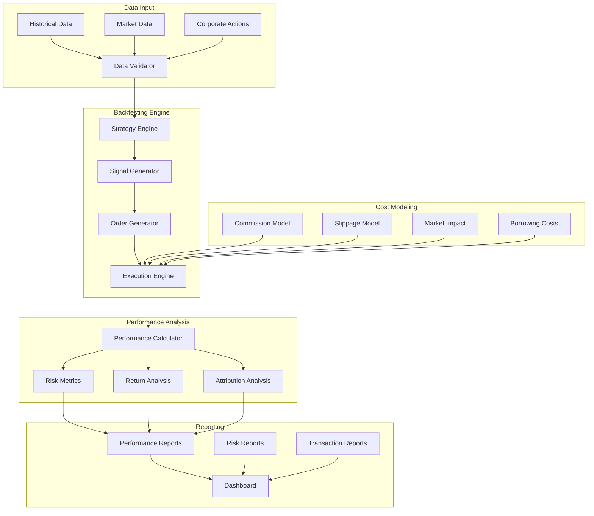

# Backtesting Documentation

## 📊 Overview

The backtesting engine provides realistic simulation of trading strategies using historical data. It focuses on accurate transaction cost modeling, realistic execution assumptions, and comprehensive performance analysis to ensure backtest results are representative of live trading performance.

## 🏗️ Architecture

## 🔧 Core Components

### Strategy Engine
**Purpose**: Execute trading strategies against historical data.

**Key Features**:
- **Signal Generation**: Generate trading signals from strategy
- **Order Management**: Create and manage orders
- **Position Tracking**: Track portfolio positions
- **Performance Calculation**: Calculate strategy performance

**Execution Flow**:
1. **Data Input**: Load historical market data
2. **Signal Generation**: Generate trading signals
3. **Order Creation**: Create buy/sell orders
4. **Order Execution**: Execute orders with costs
5. **Position Update**: Update portfolio positions
6. **Performance Update**: Update performance metrics

### Execution Engine
**Purpose**: Simulate realistic order execution with market impact and costs.

**Execution Features**:
- **Market Orders**: Immediate execution at market price
- **Limit Orders**: Execution at specified price levels
- **Stop Orders**: Execution when price reaches stop level
- **Partial Fills**: Handle partial order execution

**Market Impact Modeling**:
- **Volume Impact**: Price impact based on order size
- **Time Impact**: Price impact based on execution time
- **Volatility Impact**: Price impact based on market volatility
- **Liquidity Impact**: Price impact based on market liquidity

### Cost Modeling
**Purpose**: Model realistic transaction costs and market impact.

**Commission Models**:
- **Fixed Commission**: Fixed fee per trade
- **Percentage Commission**: Percentage of trade value
- **Tiered Commission**: Commission based on trade size
- **Exchange-Specific**: Different rates per exchange

**Slippage Models**:
- **Fixed Slippage**: Fixed slippage per trade
- **Volume Slippage**: Slippage based on order size
- **Volatility Slippage**: Slippage based on market volatility
- **Time Slippage**: Slippage based on execution time

**Market Impact**:
- **Linear Impact**: Linear relationship with order size
- **Square Root Impact**: Square root relationship with order size
- **Exponential Impact**: Exponential relationship with order size
- **Regime-Dependent**: Impact varies with market regime

## 📈 Performance Analysis

### Return Metrics
- **Total Return**: Absolute return over period
- **Annualized Return**: Return annualized
- **Cumulative Return**: Cumulative return over time
- **Excess Return**: Return above benchmark
- **Risk-Free Return**: Return above risk-free rate

### Risk Metrics
- **Volatility**: Standard deviation of returns
- **Sharpe Ratio**: Risk-adjusted return
- **Sortino Ratio**: Downside risk-adjusted return
- **Calmar Ratio**: Return to max drawdown ratio
- **Information Ratio**: Active return to tracking error

### Drawdown Analysis
- **Maximum Drawdown**: Largest peak-to-trough decline
- **Average Drawdown**: Average drawdown over period
- **Drawdown Duration**: Time to recover from drawdown
- **Drawdown Frequency**: How often drawdowns occur
- **Underwater Periods**: Time spent below previous peak

### Risk-Adjusted Metrics
- **Value at Risk (VaR)**: Potential losses at confidence level
- **Expected Shortfall**: Expected losses beyond VaR
- **Tail Risk**: Risk of extreme losses
- **Skewness**: Asymmetry of return distribution
- **Kurtosis**: Fat tails of return distribution

## 🔍 Walk-Forward Analysis

### Walk-Forward Validation
**Purpose**: Test strategy performance using rolling time windows.

**Methodology**:
- **Training Period**: Use data for strategy development
- **Testing Period**: Use data for strategy validation
- **Rolling Windows**: Move windows forward in time
- **Out-of-Sample Testing**: Test on unseen data

**Benefits**:
- **Realistic Testing**: Simulates real-world conditions
- **Overfitting Prevention**: Prevents overfitting to historical data
- **Performance Stability**: Tests performance consistency
- **Regime Adaptation**: Tests across different market regimes

### Cross-Validation
**Purpose**: Validate strategy performance across different time periods.

**Methods**:
- **Time Series CV**: Rolling window cross-validation
- **Purged CV**: Remove overlapping samples
- **Embargo CV**: Add gap between train and test
- **Monte Carlo CV**: Random time series splits

## 📊 Performance Attribution

### Factor Attribution
**Purpose**: Understand what drives strategy performance.

**Factors**:
- **Market Factor**: Performance from market movements
- **Size Factor**: Performance from size exposure
- **Value Factor**: Performance from value exposure
- **Momentum Factor**: Performance from momentum exposure
- **Volatility Factor**: Performance from volatility exposure

### Strategy Attribution
**Purpose**: Understand performance contribution from different strategies.

**Attribution**:
- **Strategy Allocation**: Performance from strategy allocation
- **Strategy Selection**: Performance from strategy selection
- **Strategy Interaction**: Performance from strategy interactions
- **Timing**: Performance from timing decisions

### Asset Attribution
**Purpose**: Understand performance contribution from different assets.

**Attribution**:
- **Asset Allocation**: Performance from asset allocation
- **Asset Selection**: Performance from asset selection
- **Asset Interaction**: Performance from asset interactions
- **Rebalancing**: Performance from rebalancing decisions

## 🚨 Risk Management

### Position Limits
- **Symbol Limits**: Maximum position per symbol
- **Sector Limits**: Maximum exposure per sector
- **Currency Limits**: Maximum exposure per currency
- **Leverage Limits**: Maximum leverage allowed

### Portfolio Limits
- **Total Exposure**: Maximum total portfolio exposure
- **Correlation Limits**: Maximum correlation between positions
- **Concentration Limits**: Maximum concentration in single asset
- **Liquidity Limits**: Minimum liquidity requirements

### Drawdown Management
- **Drawdown Limits**: Maximum allowed drawdown
- **Drawdown Alerts**: Alert on drawdown thresholds
- **Recovery Plans**: Plans for drawdown recovery
- **Stop-Loss Rules**: Automatic position closure rules

## 🔧 Configuration

### Backtesting Parameters
- **Start Date**: Backtesting start date
- **End Date**: Backtesting end date
- **Initial Capital**: Starting capital amount
- **Rebalancing Frequency**: How often to rebalance
- **Transaction Costs**: Commission and slippage rates

### Strategy Parameters
- **Lookback Periods**: Historical data periods
- **Signal Thresholds**: Minimum signal strength
- **Risk Parameters**: Risk management parameters
- **Position Sizing**: Position sizing rules

### Performance Parameters
- **Benchmark**: Benchmark for comparison
- **Risk-Free Rate**: Risk-free rate for calculations
- **Confidence Levels**: VaR confidence levels
- **Reporting Frequency**: How often to report

## 📈 Reporting

### Performance Reports
- **Summary Statistics**: Key performance metrics
- **Return Analysis**: Return breakdown and analysis
- **Risk Analysis**: Risk metrics and analysis
- **Drawdown Analysis**: Drawdown analysis and recovery

### Risk Reports
- **Risk Metrics**: Comprehensive risk metrics
- **Stress Testing**: Stress test results
- **Scenario Analysis**: Scenario analysis results
- **Monte Carlo Analysis**: Monte Carlo simulation results

### Transaction Reports
- **Trade Analysis**: Individual trade analysis
- **Cost Analysis**: Transaction cost analysis
- **Execution Analysis**: Order execution analysis
- **Slippage Analysis**: Slippage analysis and trends

## 🔮 Future Enhancements

### Advanced Features
- **Multi-Asset Backtesting**: Backtest across asset classes
- **Options Backtesting**: Backtest options strategies
- **Futures Backtesting**: Backtest futures strategies
- **Cryptocurrency Backtesting**: Specialized crypto backtesting

### Performance Improvements
- **Parallel Processing**: Parallel backtesting execution
- **GPU Acceleration**: GPU-accelerated calculations
- **Distributed Computing**: Distributed backtesting
- **Real-Time Backtesting**: Real-time strategy testing

### Risk Management
- **Dynamic Risk Management**: Adaptive risk limits
- **Stress Testing**: Regular stress testing
- **Scenario Analysis**: What-if scenario analysis
- **Monte Carlo Simulation**: Monte Carlo risk analysis

## 📚 Related Documentation

- [Trading Strategies](trading_strategies.md) - Strategy implementations
- [Model Training](model_training.md) - ML model development
- [Performance Analysis](performance.md) - Performance analysis framework
- [Development Plan](../development_plan.md) - Implementation timeline
