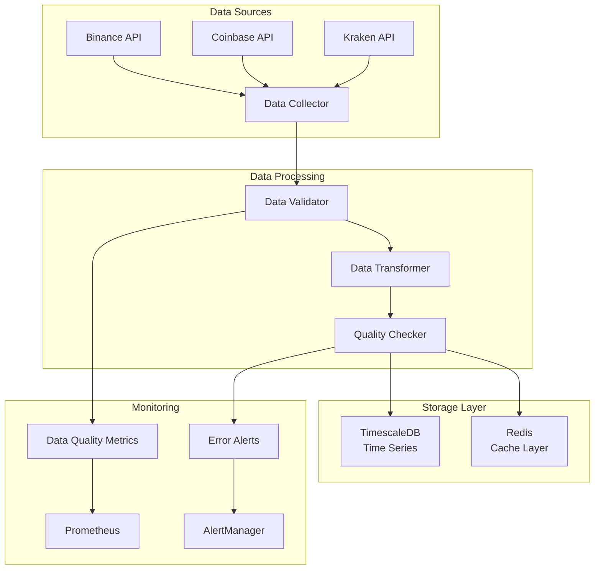

# Data Pipeline Documentation

## 🔄 Overview

The data pipeline is the foundation of the trading platform, responsible for reliable data ingestion, validation, and storage from cryptocurrency exchanges. It ensures high-quality, time-series data is available for feature engineering and model training.

## 🏗️ Architecture

## 📊 Data Sources

### Supported Exchanges

| Exchange | API Provider | Rate Limits | Data Quality | Status |
|----------|-------------|-------------|--------------|---------|
| Binance | ccxt | 1200/min | High | ✅ Active |
| Coinbase Pro | ccxt | 10/s | High | ✅ Active |
| Kraken | ccxt | 1/s | Medium | ✅ Active |
| Bitfinex | ccxt | 90/min | Medium | 🔄 Planned |

### Data Types

#### OHLCV Data
- **Open**: Opening price
- **High**: Highest price
- **Low**: Lowest price  
- **Close**: Closing price
- **Volume**: Trading volume
- **Timestamp**: UTC timestamp

#### Order Book Data
- **Bids**: Buy orders with price and quantity
- **Asks**: Sell orders with price and quantity
- **Timestamp**: Snapshot timestamp

#### Trade Data
- **Price**: Trade execution price
- **Quantity**: Trade size
- **Side**: Buy or sell
- **Timestamp**: Trade execution time

## 🔧 Core Components

### Data Collector
**Purpose**: Fetches real-time and historical data from multiple cryptocurrency exchanges using the ccxt library.

**Key Responsibilities**:
- Multi-exchange data aggregation
- Rate limiting and API quota management
- Data deduplication across exchanges
- Error handling and retry logic

**Key Features**:
- Asynchronous data fetching
- Exchange-specific rate limiting
- Automatic failover between exchanges
- Data freshness monitoring

### Data Validator
**Purpose**: Ensures data quality and consistency before storage.

**Validation Rules**:
- **Price Consistency**: OHLC relationships (High ≥ Low, High ≥ Open, High ≥ Close)
- **Volume Validation**: Non-negative volumes, outlier detection
- **Timestamp Validation**: No future timestamps, no duplicates
- **Data Completeness**: Required fields present

**Quality Metrics**:
- Data completeness score
- Consistency score
- Freshness score
- Overall quality score (0-1)

### Data Transformer
**Purpose**: Standardizes and enriches raw market data.

**Transformations**:
- **Derived Columns**: Returns, log returns, price ranges
- **Technical Indicators**: Moving averages, RSI, Bollinger Bands
- **Resampling**: Consistent time intervals across exchanges
- **Normalization**: Standardized data formats

### Storage Layer

#### TimescaleDB
**Purpose**: Time-series optimized database for historical data storage.

**Schema Design**:
- Hypertables for efficient time-series queries
- Continuous aggregates for different timeframes
- Optimized indexes for symbol and timestamp queries
- Automatic data compression and retention policies

**Key Tables**:
- `ohlcv`: Main OHLCV data with technical indicators
- `order_book`: Order book snapshots
- `trades`: Individual trade records

#### Redis Cache
**Purpose**: High-speed caching layer for frequently accessed data.

**Cache Strategy**:
- **OHLCV Data**: Cached by symbol and timeframe
- **Features**: Computed features cached for quick access
- **Session Data**: User sessions and API state
- **TTL Management**: Automatic expiration based on data freshness

## 📈 Data Quality Monitoring

### Quality Metrics

#### Completeness Score
- Measures percentage of non-null values
- Tracks missing data patterns
- Identifies data gaps

#### Consistency Score
- Validates OHLC price relationships
- Checks for negative values
- Ensures logical data flow

#### Freshness Score
- Measures data age vs. expected update frequency
- Tracks real-time data latency
- Identifies stale data sources

#### Accuracy Score
- Detects duplicate timestamps
- Identifies price outliers
- Validates against known market conditions

### Monitoring Dashboard
- Real-time quality metrics
- Historical trends
- Alert thresholds and notifications
- Data source performance comparison

## 🚨 Error Handling & Recovery

### Retry Logic
- **Exponential Backoff**: Increasing delays between retries
- **Circuit Breaker**: Temporary suspension of failing services
- **Graceful Degradation**: Continue with available data sources

### Error Categories
- **Network Errors**: Connection timeouts, rate limits
- **Data Quality Errors**: Invalid data, missing fields
- **System Errors**: Database failures, memory issues

### Recovery Strategies
- **Automatic Retry**: For transient network issues
- **Data Source Failover**: Switch to backup exchanges
- **Data Reconstruction**: Fill gaps using interpolation
- **Manual Intervention**: Alert for critical failures

## 📊 Performance Characteristics

### Latency Targets
- **Data Ingestion**: < 1 second per batch
- **Data Validation**: < 100ms per record
- **Cache Retrieval**: < 10ms
- **Database Queries**: < 50ms

### Throughput Targets
- **Data Points**: 1M+ per day
- **Concurrent Requests**: 100+ simultaneous
- **Cache Hit Rate**: > 90%
- **Data Freshness**: < 5 minutes

### Scalability
- **Horizontal Scaling**: Multiple data collector instances
- **Database Sharding**: By symbol and time
- **Cache Distribution**: Redis cluster setup
- **Load Balancing**: API request distribution

## 🔍 Monitoring & Alerting

### Key Metrics
- **Data Volume**: Records per minute/hour
- **Data Quality**: Quality scores over time
- **System Health**: Component status and performance
- **Error Rates**: Failed requests and data issues

### Alert Conditions
- **Data Quality**: Quality score below threshold
- **Data Freshness**: Stale data detection
- **System Health**: Component failures
- **Performance**: Latency or throughput issues

### Dashboard Components
- **Real-time Metrics**: Live data flow visualization
- **Quality Trends**: Historical quality scores
- **System Status**: Component health overview
- **Error Analysis**: Failure patterns and root causes

## 🛠️ Configuration

### Environment Variables
- **Database**: Connection strings and credentials
- **Redis**: Cache configuration and TTL settings
- **Exchanges**: API keys and rate limits
- **Monitoring**: Metrics collection and alerting

### Feature Flags
- **Data Sources**: Enable/disable specific exchanges
- **Validation Rules**: Adjust quality thresholds
- **Caching**: Control cache behavior
- **Monitoring**: Toggle metrics collection

## 🔮 Future Enhancements

### Planned Features
- **Real-time Streaming**: WebSocket data feeds
- **Advanced Analytics**: Market microstructure analysis
- **Data Lineage**: Track data transformations
- **Machine Learning**: Automated quality scoring

### Scalability Improvements
- **Distributed Processing**: Apache Kafka integration
- **Cloud Storage**: S3/GCS for historical data
- **Advanced Caching**: Multi-tier cache architecture
- **API Gateway**: Centralized data access layer

## 📚 Related Documentation

- [Feature Engineering](feature_engineering.md) - How data is transformed into features
- [Model Training](model_training.md) - How data is used for ML training
- [API Reference](../api_reference.md) - Data access endpoints
- [Deployment Guide](../deployment.md) - Infrastructure setup