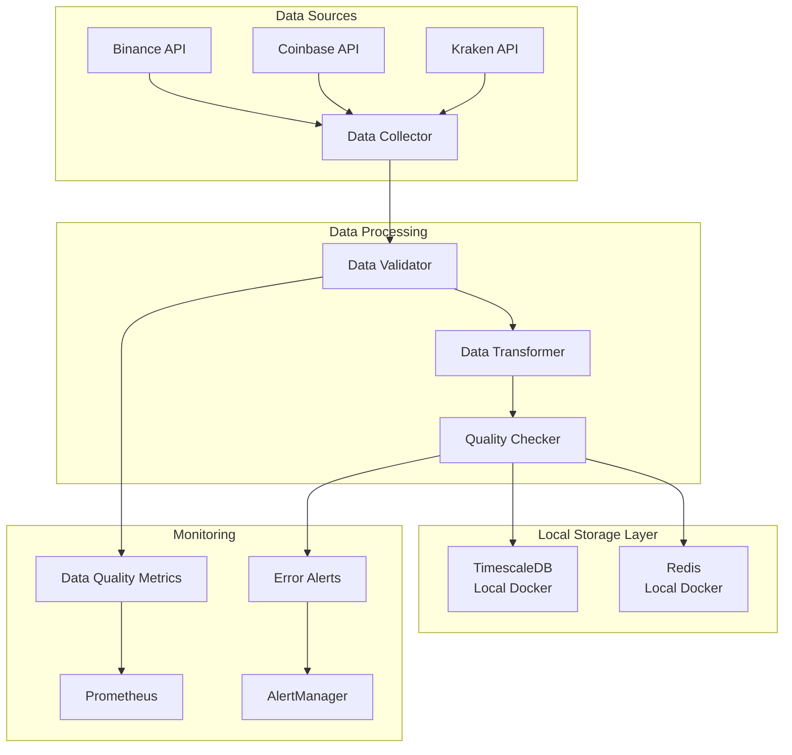

# Data Pipeline Architecture

## 🏗️ System Architecture Overview

The data pipeline is designed as a high-performance, locally-deployed system optimized for a high-specification server environment.

## 🖥️ Infrastructure Specifications

### **Target Server Configuration**
- **CPU**: 128 cores
- **RAM**: 256 GB DDR4
- **Storage**: High-performance SSD (recommended)
- **Network**: High-bandwidth connection for real-time data feeds
- **Deployment**: Local on-premises (no cloud dependencies)

### **Architecture Decision: Local Deployment**
**Date**: October 25, 2025  
**Decision**: Opt for local database deployment over cloud hosting  
**Rationale**: 
- Optimize performance with direct hardware access
- Avoid monthly cloud costs for portfolio project
- Leverage high-specification server capabilities
- Reduce network latency for real-time trading operations

## 🗄️ Database Architecture

### **Dual Database Strategy**

#### **TimescaleDB - Time-Series Data Storage**
- **Purpose**: Historical data, analytics, long-term storage
- **Deployment**: Local Docker container
- **Configuration**: Optimized for 128-core system
- **Use Cases**:
  - OHLCV historical data storage
  - Order book snapshots
  - Trade records and execution data
  - Technical indicators and derived features
  - Backtesting data and results

#### **Redis - In-Memory Cache & Session Management**
- **Purpose**: High-speed caching, real-time data access
- **Deployment**: Local Docker container
- **Configuration**: Optimized for 256GB RAM system
- **Use Cases**:
  - Cached OHLCV data for fast retrieval
  - Computed features caching
  - User sessions and API state
  - Real-time trading signals
  - Temporary data storage

## 🔄 Data Flow Architecture



## 🚀 Performance Optimizations

### **TimescaleDB Configuration**
- **Connection Pooling**: Optimized for 128-core system
- **Hypertables**: Time-series optimized storage
- **Continuous Aggregates**: Pre-computed time-series aggregations
- **Compression**: Automatic data compression for historical data
- **Indexing**: Optimized indexes for symbol and timestamp queries

### **Redis Configuration**
- **Memory Allocation**: Optimized for 256GB RAM system
- **Persistence**: RDB + AOF for data durability
- **Clustering**: Single-node optimized for local deployment
- **TTL Management**: Intelligent cache expiration
- **Memory Optimization**: Efficient data structures

## 📊 Resource Allocation

### **CPU Allocation (128 cores)**
- **TimescaleDB**: 32 cores (25%)
- **Redis**: 16 cores (12.5%)
- **Data Collector**: 32 cores (25%)
- **Data Processing**: 32 cores (25%)
- **Monitoring**: 8 cores (6.25%)
- **System Reserve**: 8 cores (6.25%)

### **Memory Allocation (256GB)**
- **TimescaleDB**: 64GB (25%)
- **Redis**: 128GB (50%)
- **Data Collector**: 32GB (12.5%)
- **Data Processing**: 16GB (6.25%)
- **Monitoring**: 8GB (3.125%)
- **System Reserve**: 8GB (3.125%)

## 🔧 Local Deployment Benefits

### **Performance Advantages**
- **Zero Network Latency**: Direct hardware access
- **High Throughput**: 1M+ data points per day
- **Low Latency**: <10ms data retrieval
- **Scalability**: Full server resource utilization

### **Cost Benefits**
- **No Monthly Costs**: Zero cloud database fees
- **Predictable Costs**: Only server hardware costs
- **No Vendor Lock-in**: Complete control over data
- **Offline Capability**: Works without internet

### **Development Benefits**
- **Fast Development**: No network dependencies
- **Easy Debugging**: Direct database access
- **Full Control**: Complete system customization
- **Testing**: Isolated development environment

## 🛠️ Docker Configuration

### **TimescaleDB Container**
```yaml
timescaledb:
  image: timescale/timescaledb:latest
  environment:
    POSTGRES_DB: trading_data
    POSTGRES_USER: trader
    POSTGRES_PASSWORD: secure_password
  volumes:
    - timescale_data:/var/lib/postgresql/data
  ports:
    - "5432:5432"
  deploy:
    resources:
      limits:
        cpus: '32'
        memory: 64G
```

### **Redis Container**
```yaml
redis:
  image: redis:7-alpine
  volumes:
    - redis_data:/data
  ports:
    - "6379:6379"
  deploy:
    resources:
      limits:
        cpus: '16'
        memory: 128G
```

## 📈 Scalability Considerations

### **Horizontal Scaling**
- **Multiple Data Collectors**: Distribute across cores
- **Database Sharding**: By symbol and time ranges
- **Load Balancing**: API request distribution
- **Microservices**: Component isolation

### **Vertical Scaling**
- **CPU Optimization**: Core-specific task allocation
- **Memory Management**: Efficient memory usage
- **Storage Optimization**: SSD performance tuning
- **Network Optimization**: High-bandwidth utilization

## 🔒 Security Considerations

### **Local Security**
- **Network Isolation**: Internal network only
- **Access Control**: Local user authentication
- **Data Encryption**: At-rest and in-transit encryption
- **Backup Security**: Encrypted backup procedures

### **Data Protection**
- **Regular Backups**: Automated backup procedures
- **Data Retention**: Configurable retention policies
- **Access Logging**: Comprehensive audit trails
- **Recovery Procedures**: Disaster recovery plans

## 📊 Monitoring & Alerting

### **System Monitoring**
- **Resource Usage**: CPU, memory, disk, network
- **Database Performance**: Query performance, connection pools
- **Cache Performance**: Hit rates, memory usage
- **Data Quality**: Real-time quality metrics

### **Alerting Thresholds**
- **CPU Usage**: >80% for 5 minutes
- **Memory Usage**: >90% for 2 minutes
- **Disk Space**: >85% capacity
- **Data Quality**: <0.8 quality score
- **Data Freshness**: >5 minutes stale

## 🔄 Future Enhancements

### **Planned Improvements**
- **Real-time Streaming**: WebSocket data feeds
- **Advanced Analytics**: Market microstructure analysis
- **Machine Learning**: Automated quality scoring
- **API Gateway**: Centralized data access layer

### **Scalability Roadmap**
- **Distributed Processing**: Apache Kafka integration
- **Advanced Caching**: Multi-tier cache architecture
- **Cloud Hybrid**: Optional cloud backup
- **Edge Computing**: Distributed data processing

## 📚 Related Documentation

- [Data Pipeline Component](../data_pipeline.md)
- [Infrastructure Setup](../../infrastructure.md)
- [Monitoring Configuration](../../monitoring.md)
- [Deployment Guide](../../deployment.md)

---

**Last Updated**: October 25, 2025  
**Version**: 1.0  
**Maintainer**: Development Team
