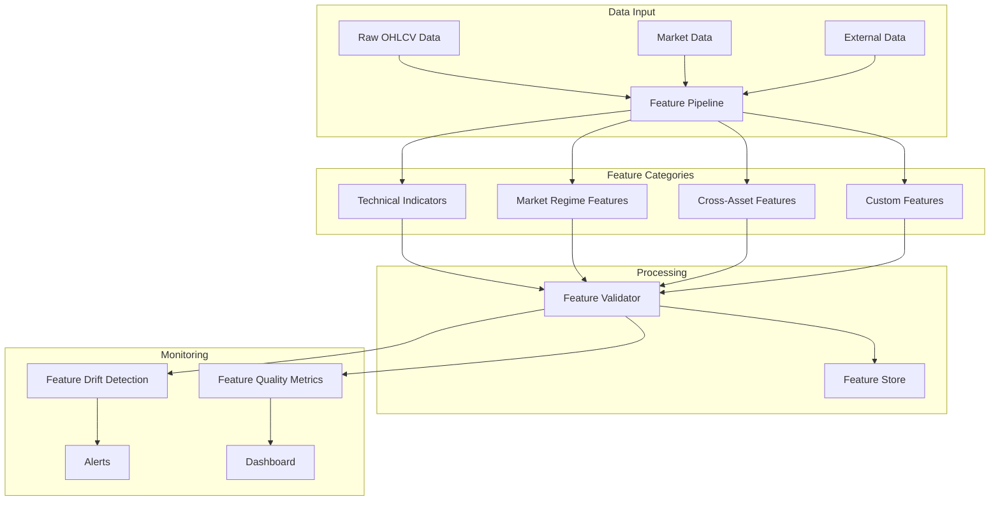

# Feature Engineering Documentation

## 🔧 Overview

The feature engineering pipeline transforms raw market data into meaningful features for machine learning models. It focuses on creating financially relevant features while maintaining data quality and preventing look-ahead bias.

## 🏗️ Architecture

## 📊 Feature Categories

### Technical Indicators

#### Momentum Indicators
- **RSI (Relative Strength Index)**: Measures overbought/oversold conditions
- **MACD (Moving Average Convergence Divergence)**: Trend following indicator
- **Stochastic Oscillator**: Momentum indicator comparing closing price to price range
- **Williams %R**: Momentum indicator similar to stochastic

#### Trend Indicators
- **Simple Moving Averages (SMA)**: 5, 10, 20, 50, 200 day averages
- **Exponential Moving Averages (EMA)**: 12, 26, 50 day averages
- **ADX (Average Directional Index)**: Trend strength measurement
- **Parabolic SAR**: Trend following indicator

#### Volatility Indicators
- **Bollinger Bands**: Price channels based on standard deviation
- **ATR (Average True Range)**: Volatility measurement
- **Keltner Channels**: Volatility-based price channels
- **Donchian Channels**: Price range channels

### Market Regime Features

#### Volatility Regime Detection
- **VIX Proxy**: Volatility measurement using price data
- **Volatility Clustering**: GARCH-based volatility modeling
- **Regime Classification**: Bull/bear/sideways market detection
- **Volatility Persistence**: How long volatility regimes last

#### Trend Detection
- **Trend Strength**: ADX-based trend measurement
- **Trend Direction**: Moving average crossovers
- **Trend Persistence**: How long trends last
- **Trend Reversal**: Early warning signals

### Cross-Asset Features

#### Market Correlations
- **BTC Dominance**: Bitcoin's market share
- **Cross-Asset Correlations**: Relationships between assets
- **Sector Rotation**: Money flow between sectors
- **Risk-On/Risk-Off**: Market sentiment indicators

#### Relative Strength
- **Asset Performance**: Relative to market average
- **Sector Performance**: Relative to sector average
- **Momentum Ranking**: Performance ranking across assets
- **Mean Reversion Signals**: Overbought/oversold relative to peers

### Custom Features

#### Market Microstructure
- **Order Book Imbalance**: Bid/ask pressure
- **Trade Size Distribution**: Large vs small trades
- **Tick-by-Tick Features**: High-frequency patterns
- **Volume Profile**: Volume at different price levels

#### Time-Based Features
- **Intraday Patterns**: Hour of day effects
- **Day of Week Effects**: Weekly patterns
- **Seasonal Patterns**: Monthly/quarterly effects
- **Market Session Features**: Different exchange sessions

## 🔧 Feature Pipeline

### Data Validation
- **Look-Ahead Bias Prevention**: Only use past data for features
- **Data Quality Checks**: Ensure data completeness and consistency
- **Outlier Detection**: Identify and handle extreme values
- **Missing Data Handling**: Appropriate imputation strategies

### Feature Computation
- **Vectorized Operations**: Efficient pandas/numpy operations
- **Caching Strategy**: Cache computed features for reuse
- **Incremental Updates**: Only recompute when necessary
- **Parallel Processing**: Multi-core feature computation

### Feature Validation
- **Statistical Tests**: Ensure features are statistically valid
- **Financial Intuition**: Verify features make financial sense
- **Correlation Analysis**: Check for multicollinearity
- **Stability Tests**: Ensure features are stable over time

## 📈 Feature Store

### Storage Strategy
- **Redis Cache**: Fast access to recent features
- **TimescaleDB**: Historical feature storage
- **Feature Versioning**: Track feature changes over time
- **Metadata Storage**: Feature descriptions and lineage

### Access Patterns
- **Real-time Features**: Latest computed features
- **Historical Features**: Features for backtesting
- **Batch Features**: Features for model training
- **Feature Lineage**: Track feature transformations

## 🔍 Feature Quality Monitoring

### Drift Detection
- **Statistical Drift**: Changes in feature distributions
- **Concept Drift**: Changes in feature-target relationships
- **Data Drift**: Changes in input data distributions
- **Performance Drift**: Changes in model performance

### Quality Metrics
- **Feature Completeness**: Percentage of non-null values
- **Feature Stability**: Consistency over time
- **Feature Relevance**: Correlation with target variable
- **Feature Redundancy**: Multicollinearity detection

### Alerting
- **Drift Alerts**: Notify when features drift significantly
- **Quality Alerts**: Notify when feature quality degrades
- **Performance Alerts**: Notify when model performance drops
- **System Alerts**: Notify when feature computation fails

## 🚨 Look-Ahead Bias Prevention

### Temporal Validation
- **Time-Series Splits**: Ensure no future data leakage
- **Walk-Forward Validation**: Rolling window validation
- **Out-of-Sample Testing**: Strict temporal separation
- **Real-Time Validation**: Test with live data

### Feature Engineering Rules
- **Lag Requirements**: Minimum lag for all features
- **Information Availability**: Only use information available at time t
- **Feature Dependencies**: Track feature computation order
- **Validation Checks**: Automated bias detection

## 📊 Performance Optimization

### Computation Efficiency
- **Vectorized Operations**: Use pandas/numpy efficiently
- **Caching Strategy**: Cache expensive computations
- **Parallel Processing**: Multi-core feature computation
- **Memory Management**: Efficient memory usage

### Storage Optimization
- **Data Compression**: Compress historical features
- **Indexing Strategy**: Optimize database queries
- **Partitioning**: Partition data by time and symbol
- **Cleanup Policies**: Remove old features automatically

## 🔧 Configuration

### Feature Parameters
- **Indicator Periods**: RSI period, moving average windows
- **Lookback Windows**: How much historical data to use
- **Update Frequencies**: How often to recompute features
- **Quality Thresholds**: Minimum quality requirements

### Feature Flags
- **Enable/Disable Features**: Toggle specific features
- **Feature Groups**: Enable/disable feature categories
- **Quality Checks**: Toggle validation rules
- **Monitoring**: Toggle drift detection

## 🔮 Future Enhancements

### Advanced Features
- **Deep Learning Features**: Neural network derived features
- **Alternative Data**: News sentiment, social media data
- **Regime-Specific Features**: Features that adapt to market regimes
- **Ensemble Features**: Combinations of multiple features

### Performance Improvements
- **GPU Acceleration**: Use GPUs for feature computation
- **Distributed Computing**: Scale feature computation
- **Real-Time Streaming**: Stream feature computation
- **Advanced Caching**: Multi-tier caching strategy

## 📚 Related Documentation

- [Data Pipeline](data_pipeline.md) - How data flows into features
- [Model Training](model_training.md) - How features are used in models
- [API Reference](../api_reference.md) - Feature access endpoints
- [Development Plan](../development_plan.md) - Implementation timeline
