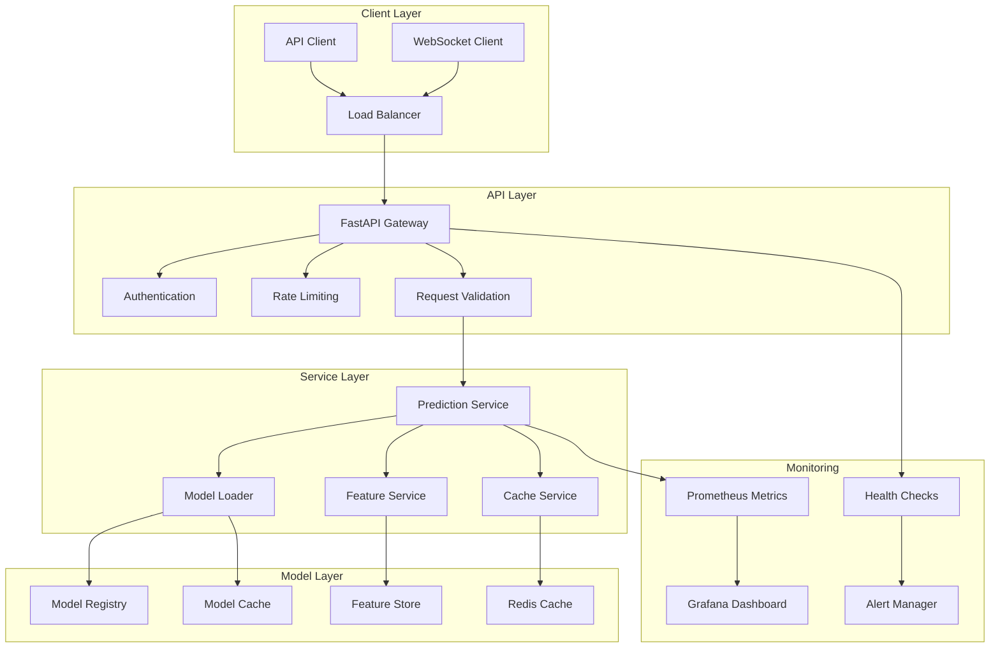

# Model Serving Documentation

## 🚀 Overview

The model serving infrastructure provides production-ready inference capabilities for the trading platform. It focuses on low-latency predictions, high availability, and robust error handling for real-time trading decisions.

## 🏗️ Architecture



## 🔧 Core Components

### FastAPI Gateway
**Purpose**: High-performance API gateway for model inference requests.

**Key Features**:
- **Async Processing**: Non-blocking request handling
- **Request Validation**: Pydantic models for input validation
- **Response Serialization**: JSON response formatting
- **Error Handling**: Comprehensive error responses

**Endpoints**:
- `POST /predict`: Single prediction request
- `POST /predict/batch`: Batch prediction request
- `GET /models`: List available models
- `GET /health`: Health check endpoint

### Prediction Service
**Purpose**: Core business logic for model inference.

**Key Responsibilities**:
- **Model Loading**: Load and cache models efficiently
- **Feature Preparation**: Prepare features for model input
- **Prediction Generation**: Run model inference
- **Response Formatting**: Format predictions for API response

**Performance Targets**:
- **Latency**: < 10ms for single predictions
- **Throughput**: 1000+ predictions per second
- **Availability**: 99.9% uptime
- **Memory**: Efficient model caching

### Model Loader
**Purpose**: Efficient model loading and caching system.

**Features**:
- **Lazy Loading**: Load models on first request
- **Model Caching**: Keep models in memory for fast access
- **Version Management**: Handle multiple model versions
- **Memory Management**: Efficient memory usage

**Supported Model Types**:
- **Scikit-learn**: Traditional ML models
- **LightGBM**: Gradient boosting models
- **TensorFlow**: Deep learning models
- **Custom Models**: PyTorch and other frameworks

### Feature Service
**Purpose**: Real-time feature computation and retrieval.

**Features**:
- **Feature Computation**: Compute features on-demand
- **Feature Caching**: Cache computed features
- **Feature Validation**: Ensure feature quality
- **Feature Lineage**: Track feature transformations

**Performance**:
- **Feature Retrieval**: < 50ms for feature computation
- **Cache Hit Rate**: > 90% for frequently used features
- **Feature Freshness**: < 1 minute for real-time features

## 📊 API Endpoints

### Prediction Endpoints

#### POST /predict
**Purpose**: Generate single prediction for a trading symbol.

**Request**:
```json
{
  "symbol": "BTC/USDT",
  "timestamp": "2024-01-15T10:30:00Z",
  "features": {
    "price": 45000.0,
    "volume": 1000000.0,
    "rsi": 65.5
  },
  "model_version": "latest"
}
```

**Response**:
```json
{
  "prediction": {
    "signal": "BUY",
    "confidence": 0.85,
    "probability": 0.78
  },
  "model_info": {
    "version": "v1.2.3",
    "training_date": "2024-01-10T00:00:00Z",
    "accuracy": 0.72
  },
  "timestamp": "2024-01-15T10:30:01Z"
}
```

#### POST /predict/batch
**Purpose**: Generate predictions for multiple symbols simultaneously.

**Request**:
```json
{
  "requests": [
    {
      "symbol": "BTC/USDT",
      "timestamp": "2024-01-15T10:30:00Z"
    },
    {
      "symbol": "ETH/USDT",
      "timestamp": "2024-01-15T10:30:00Z"
    }
  ],
  "model_version": "latest"
}
```

**Response**:
```json
{
  "predictions": [
    {
      "symbol": "BTC/USDT",
      "prediction": {
        "signal": "BUY",
        "confidence": 0.85
      }
    },
    {
      "symbol": "ETH/USDT",
      "prediction": {
        "signal": "SELL",
        "confidence": 0.72
      }
    }
  ],
  "timestamp": "2024-01-15T10:30:01Z"
}
```

### Model Management Endpoints

#### GET /models
**Purpose**: List available models and their metadata.

**Response**:
```json
{
  "models": [
    {
      "name": "lstm_momentum_v1",
      "version": "1.2.3",
      "status": "active",
      "accuracy": 0.72,
      "training_date": "2024-01-10T00:00:00Z",
      "features": ["price", "volume", "rsi", "macd"]
    }
  ]
}
```

#### GET /models/{model_name}/versions
**Purpose**: Get version history for a specific model.

**Response**:
```json
{
  "model_name": "lstm_momentum_v1",
  "versions": [
    {
      "version": "1.2.3",
      "status": "active",
      "accuracy": 0.72,
      "training_date": "2024-01-10T00:00:00Z"
    }
  ]
}
```

## 🔒 Security & Authentication

### API Key Authentication
- **API Key Validation**: Validate API keys on each request
- **Rate Limiting**: Limit requests per API key
- **Access Control**: Different permissions for different keys
- **Audit Logging**: Log all API access

### Request Validation
- **Input Sanitization**: Clean and validate all inputs
- **Schema Validation**: Validate request schemas
- **Size Limits**: Limit request and response sizes
- **Content Type**: Enforce proper content types

### Security Headers
- **CORS**: Configure cross-origin resource sharing
- **HTTPS**: Enforce HTTPS for all requests
- **Security Headers**: Add security headers
- **Rate Limiting**: Prevent abuse and DoS attacks

## 📈 Performance Optimization

### Caching Strategy
- **Model Caching**: Keep models in memory
- **Feature Caching**: Cache computed features
- **Response Caching**: Cache API responses
- **Cache Invalidation**: Smart cache invalidation

### Async Processing
- **Async I/O**: Non-blocking database and cache operations
- **Connection Pooling**: Efficient database connections
- **Background Tasks**: Process heavy operations asynchronously
- **Queue Management**: Manage request queues efficiently

### Resource Management
- **Memory Management**: Efficient memory usage
- **CPU Optimization**: Optimize CPU usage
- **Database Optimization**: Optimize database queries
- **Network Optimization**: Optimize network calls

## 🔍 Monitoring & Observability

### Metrics Collection
- **Request Metrics**: Request count, latency, error rate
- **Model Metrics**: Model performance, prediction accuracy
- **System Metrics**: CPU, memory, disk usage
- **Business Metrics**: Prediction volume, user activity

### Health Checks
- **API Health**: Check API endpoint availability
- **Model Health**: Check model loading and performance
- **Database Health**: Check database connectivity
- **Cache Health**: Check cache connectivity

### Alerting
- **Performance Alerts**: Alert on high latency or errors
- **Model Alerts**: Alert on model performance degradation
- **System Alerts**: Alert on system resource issues
- **Business Alerts**: Alert on unusual prediction patterns

## 🚨 Error Handling

### Error Categories
- **Validation Errors**: Invalid request parameters
- **Authentication Errors**: Invalid API keys
- **Model Errors**: Model loading or prediction failures
- **System Errors**: Database or cache failures

### Error Responses
- **Consistent Format**: Standardized error response format
- **Error Codes**: Unique error codes for each error type
- **Error Messages**: Clear, actionable error messages
- **Error Logging**: Log all errors for debugging

### Recovery Strategies
- **Retry Logic**: Automatic retry for transient errors
- **Fallback Models**: Use backup models when primary fails
- **Graceful Degradation**: Continue with reduced functionality
- **Circuit Breaker**: Stop requests to failing services

## 🔧 Configuration

### Model Configuration
- **Model Paths**: Paths to model files
- **Model Versions**: Available model versions
- **Model Loading**: Model loading configuration
- **Model Caching**: Model caching configuration

### API Configuration
- **Rate Limits**: Request rate limits
- **Timeout Settings**: Request timeout configuration
- **CORS Settings**: Cross-origin resource sharing
- **Security Settings**: Security configuration

### Monitoring Configuration
- **Metrics Collection**: Metrics collection settings
- **Alert Thresholds**: Alert threshold configuration
- **Logging Levels**: Logging configuration
- **Health Check Settings**: Health check configuration

## 🔮 Future Enhancements

### Advanced Features
- **Model A/B Testing**: Test multiple models simultaneously
- **Dynamic Model Selection**: Select best model per request
- **Model Ensembling**: Combine multiple model predictions
- **Real-Time Learning**: Update models with new data

### Performance Improvements
- **GPU Acceleration**: Use GPUs for model inference
- **Model Quantization**: Reduce model size and latency
- **Distributed Serving**: Scale across multiple servers
- **Edge Deployment**: Deploy models closer to users

### Monitoring Improvements
- **Advanced Analytics**: Detailed performance analytics
- **Predictive Monitoring**: Predict and prevent issues
- **Automated Scaling**: Automatically scale based on load
- **Cost Optimization**: Optimize resource usage and costs

## 📚 Related Documentation

- [Model Training](model_training.md) - How models are trained
- [API Reference](../api_reference.md) - Complete API documentation
- [Monitoring](monitoring.md) - System monitoring and alerting
- [Development Plan](../development_plan.md) - Implementation timeline
