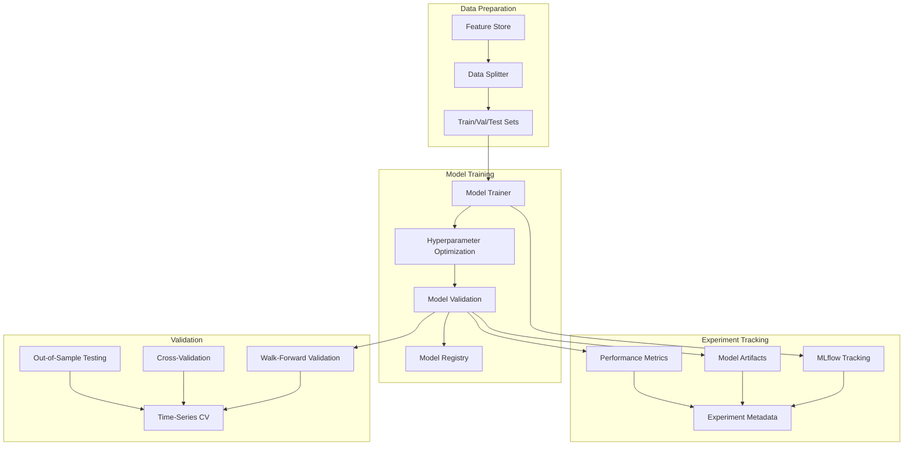

# Model Training Documentation

## 🤖 Overview

The model training infrastructure implements MLOps best practices for developing, training, and validating machine learning models for algorithmic trading. It focuses on time-series specific challenges like look-ahead bias prevention and walk-forward validation.

## 🏗️ Architecture

## 🎯 Model Types

### LSTM Models
**Purpose**: Deep learning models for sequence prediction and pattern recognition.

**Key Features**:
- **Sequence Learning**: Captures temporal dependencies in price data
- **Multi-Step Prediction**: Predicts multiple time steps ahead
- **Attention Mechanisms**: Focus on relevant time periods
- **Regime Adaptation**: Adapts to different market conditions

**Architecture**:
- **Input Layer**: Feature sequences (e.g., 50 time steps)
- **LSTM Layers**: 2-3 LSTM layers with dropout
- **Attention Layer**: Optional attention mechanism
- **Output Layer**: Prediction (regression or classification)

### LightGBM Models
**Purpose**: Gradient boosting for tabular data with high performance.

**Key Features**:
- **Feature Importance**: Understand which features matter most
- **Categorical Handling**: Handle categorical features efficiently
- **Missing Value Handling**: Robust to missing data
- **Interpretability**: Feature importance and SHAP values

**Configuration**:
- **Objective**: Regression for price prediction, binary for direction
- **Boosting**: Gradient boosting with early stopping
- **Regularization**: L1/L2 regularization to prevent overfitting
- **Cross-Validation**: Time-series aware cross-validation

### Ensemble Models
**Purpose**: Combine multiple models for improved performance and robustness.

**Ensemble Strategies**:
- **Voting**: Simple majority or weighted voting
- **Stacking**: Meta-model learns to combine predictions
- **Blending**: Weighted combination of model outputs
- **Dynamic Weighting**: Adjust weights based on recent performance

## 🔧 Training Pipeline

### Data Preparation
- **Feature Engineering**: Create relevant features from raw data
- **Data Validation**: Ensure data quality and consistency
- **Temporal Splitting**: Strict time-based train/validation/test splits
- **Feature Scaling**: Normalize features for model training

### Model Training
- **Hyperparameter Optimization**: Use Optuna for efficient search
- **Cross-Validation**: Time-series aware validation strategy
- **Early Stopping**: Prevent overfitting with validation monitoring
- **Model Checkpointing**: Save best models during training

### Validation Strategy
- **Walk-Forward Validation**: Rolling window validation
- **Out-of-Sample Testing**: Strict temporal separation
- **Performance Metrics**: Sharpe ratio, max drawdown, win rate
- **Statistical Testing**: Significance tests for model performance

## 📊 Experiment Tracking

### MLflow Integration
- **Experiment Organization**: Group related experiments
- **Parameter Logging**: Track all hyperparameters
- **Metric Logging**: Track training and validation metrics
- **Artifact Storage**: Save models, plots, and data samples

### Experiment Metadata
- **Model Configuration**: Architecture and hyperparameters
- **Data Configuration**: Features and data preprocessing
- **Training Configuration**: Optimizer, learning rate, epochs
- **Validation Results**: Performance metrics and plots

### Model Registry
- **Model Versioning**: Track model versions and changes
- **Model Staging**: Development, staging, production stages
- **Model Comparison**: Compare model performance
- **Model Deployment**: Track which models are deployed

## 🔍 Hyperparameter Optimization

### Optuna Integration
- **Search Space**: Define parameter ranges and distributions
- **Sampling Strategy**: TPE (Tree-structured Parzen Estimator)
- **Pruning**: Stop unpromising trials early
- **Multi-Objective**: Optimize multiple metrics simultaneously

### Optimization Targets
- **Primary Metric**: Sharpe ratio for trading models
- **Secondary Metrics**: Max drawdown, win rate, accuracy
- **Constraints**: Maximum drawdown limits, minimum win rate
- **Validation Strategy**: Walk-forward validation for optimization

### Search Strategies
- **Grid Search**: Exhaustive search for small parameter spaces
- **Random Search**: Random sampling of parameter space
- **Bayesian Optimization**: Efficient search using Gaussian processes
- **Evolutionary Algorithms**: Genetic algorithms for complex spaces

## 📈 Model Validation

### Time-Series Cross-Validation
- **Walk-Forward Validation**: Rolling window approach
- **Purged Cross-Validation**: Remove overlapping samples
- **Embargo Period**: Add gap between train and validation
- **Monte Carlo CV**: Multiple random time-series splits

### Performance Metrics
- **Financial Metrics**: Sharpe ratio, max drawdown, Calmar ratio
- **Statistical Metrics**: Accuracy, precision, recall, F1-score
- **Risk Metrics**: Value at Risk (VaR), Conditional VaR
- **Stability Metrics**: Performance consistency over time

### Model Selection
- **Performance Comparison**: Statistical significance testing
- **Robustness Testing**: Performance across different market conditions
- **Stability Analysis**: Performance consistency over time
- **Risk-Adjusted Returns**: Consider risk in model selection

## 🚨 Look-Ahead Bias Prevention

### Temporal Validation
- **Strict Time Splits**: No future data in training
- **Walk-Forward Testing**: Rolling window validation
- **Out-of-Sample Testing**: Hold-out test set
- **Real-Time Validation**: Test with live data

### Data Leakage Prevention
- **Feature Engineering**: Only use past data for features
- **Target Engineering**: Ensure target variable is future-appropriate
- **Validation Checks**: Automated bias detection
- **Code Reviews**: Manual review for bias prevention

## 📊 Model Performance Monitoring

### Training Monitoring
- **Loss Curves**: Monitor training and validation loss
- **Learning Curves**: Track performance vs. training size
- **Overfitting Detection**: Gap between train and validation performance
- **Convergence Monitoring**: Ensure models converge properly

### Production Monitoring
- **Prediction Drift**: Monitor prediction distributions
- **Feature Drift**: Monitor input feature distributions
- **Performance Degradation**: Track model performance over time
- **Alert System**: Notify when performance drops

## 🔧 Model Deployment

### Model Serving
- **Model Loading**: Efficient model loading and caching
- **Prediction Pipeline**: End-to-end prediction workflow
- **Batch Processing**: Batch predictions for efficiency
- **Real-Time Processing**: Low-latency predictions

### Model Updates
- **A/B Testing**: Test new models against current models
- **Gradual Rollout**: Slowly increase traffic to new models
- **Rollback Strategy**: Quick rollback to previous models
- **Performance Monitoring**: Monitor new model performance

## 📚 Configuration

### Training Configuration
- **Model Parameters**: Architecture and hyperparameters
- **Training Parameters**: Learning rate, batch size, epochs
- **Validation Parameters**: Validation strategy and metrics
- **Optimization Parameters**: Optuna configuration

### Environment Configuration
- **MLflow URI**: Experiment tracking server
- **Model Registry**: Model storage and versioning
- **Compute Resources**: GPU/CPU configuration
- **Storage**: Model and artifact storage

## 🔮 Future Enhancements

### Advanced Models
- **Transformer Models**: Attention-based sequence models
- **Reinforcement Learning**: RL for trading strategy optimization
- **Ensemble Methods**: Advanced ensemble strategies
- **Meta-Learning**: Learn to learn across different market conditions

### MLOps Improvements
- **Automated Retraining**: Trigger retraining based on performance
- **Model Drift Detection**: Automatic drift detection and retraining
- **A/B Testing Framework**: Systematic model comparison
- **Model Explainability**: SHAP, LIME, and other explainability tools

## 📚 Related Documentation

- [Feature Engineering](feature_engineering.md) - How features are created
- [Model Serving](model_serving.md) - How models are deployed
- [Backtesting](backtesting.md) - How models are validated
- [Development Plan](../development_plan.md) - Implementation timeline
