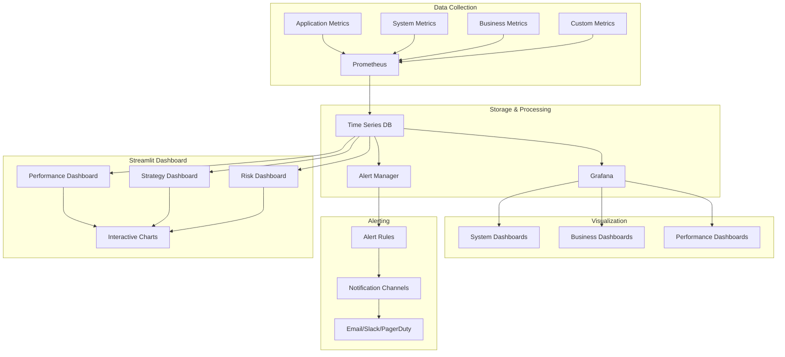

# Monitoring & Observability Documentation

## 📊 Overview

The monitoring system provides comprehensive observability for the trading platform, including system health, performance metrics, business metrics, and alerting. It ensures the platform operates reliably and provides insights for optimization.

## 🏗️ Architecture

## 🔧 Core Components

### Prometheus Metrics Collection
**Purpose**: Collect and store time-series metrics from all system components.

**Metric Types**:
- **Counters**: Cumulative metrics (total requests, errors)
- **Gauges**: Point-in-time metrics (current connections, memory usage)
- **Histograms**: Distribution metrics (request duration, response size)
- **Summaries**: Quantile metrics (percentiles, averages)

**Key Metrics**:
- **System Metrics**: CPU, memory, disk, network usage
- **Application Metrics**: Request count, latency, error rate
- **Business Metrics**: Predictions, accuracy, trading volume
- **ML Metrics**: Model performance, feature drift, prediction latency

### Grafana Dashboards
**Purpose**: Visualize metrics and provide operational insights.

**Dashboard Categories**:
- **System Overview**: Overall system health and performance
- **API Performance**: API metrics and performance
- **ML Pipeline**: Model training and inference metrics
- **Trading Performance**: Strategy and trading metrics
- **Data Quality**: Data pipeline and quality metrics

**Key Features**:
- **Real-time Monitoring**: Live system status
- **Historical Analysis**: Trend analysis and patterns
- **Alerting Integration**: Visual alert status
- **Custom Queries**: Flexible metric queries

### Streamlit Dashboard
**Purpose**: Interactive business intelligence and performance analysis.

**Dashboard Sections**:
- **Performance Overview**: Key performance indicators
- **Strategy Analysis**: Individual strategy performance
- **Risk Analysis**: Risk metrics and monitoring
- **Model Performance**: ML model performance and drift

**Interactive Features**:
- **Time Range Selection**: Flexible time period analysis
- **Strategy Filtering**: Filter by strategy or symbol
- **Metric Selection**: Choose metrics to display
- **Export Functionality**: Export data and charts

## 📈 Metrics Categories

### System Metrics
**Purpose**: Monitor infrastructure health and performance.

**Key Metrics**:
- **CPU Usage**: CPU utilization across services
- **Memory Usage**: Memory consumption and trends
- **Disk Usage**: Disk space and I/O performance
- **Network Usage**: Network traffic and latency
- **Service Health**: Service availability and status

**Alerting**:
- **High CPU Usage**: CPU > 80% for 5 minutes
- **High Memory Usage**: Memory > 90% for 5 minutes
- **Disk Space**: Disk usage > 85%
- **Service Down**: Service unavailable for 1 minute

### Application Metrics
**Purpose**: Monitor application performance and behavior.

**Key Metrics**:
- **Request Rate**: Requests per second
- **Response Time**: API response latency
- **Error Rate**: Percentage of failed requests
- **Throughput**: Data processing throughput
- **Queue Length**: Message queue lengths

**Alerting**:
- **High Error Rate**: Error rate > 5% for 5 minutes
- **High Latency**: Response time > 1 second for 5 minutes
- **Low Throughput**: Throughput < 50% of normal
- **Queue Backup**: Queue length > 1000 messages

### Business Metrics
**Purpose**: Monitor business performance and trading activity.

**Key Metrics**:
- **Prediction Volume**: Number of predictions per hour
- **Prediction Accuracy**: Model accuracy over time
- **Trading Volume**: Trading activity and volume
- **Strategy Performance**: Strategy returns and metrics
- **User Activity**: User engagement and usage

**Alerting**:
- **Low Accuracy**: Model accuracy < 60% for 1 hour
- **High Losses**: Strategy losses > 5% in 1 day
- **Unusual Activity**: Unusual trading patterns
- **System Degradation**: Performance degradation

### ML Metrics
**Purpose**: Monitor machine learning pipeline performance.

**Key Metrics**:
- **Model Performance**: Accuracy, precision, recall
- **Feature Drift**: Feature distribution changes
- **Prediction Latency**: Model inference time
- **Training Metrics**: Training loss and validation metrics
- **Data Quality**: Input data quality scores

**Alerting**:
- **Model Drift**: Significant model performance change
- **Feature Drift**: Feature distribution drift
- **High Latency**: Prediction latency > 100ms
- **Data Quality**: Data quality score < 0.8

## 🚨 Alerting System

### Alert Rules
**Purpose**: Define conditions that trigger alerts.

**Rule Types**:
- **Threshold Rules**: Alert when metric exceeds threshold
- **Anomaly Rules**: Alert on unusual patterns
- **Trend Rules**: Alert on trend changes
- **Composite Rules**: Alert based on multiple conditions

**Alert Severity**:
- **Critical**: System down, data loss, security breach
- **Warning**: Performance degradation, quality issues
- **Info**: Status changes, maintenance notifications
- **Debug**: Development and troubleshooting info

### Notification Channels
**Purpose**: Deliver alerts to appropriate recipients.

**Channels**:
- **Email**: Detailed alerts with context
- **Slack**: Real-time team notifications
- **PagerDuty**: Critical incident management
- **Webhook**: Custom integrations

**Escalation**:
- **Immediate**: Critical alerts sent immediately
- **Delayed**: Non-critical alerts with delay
- **Escalation**: Unacknowledged alerts escalated
- **Suppression**: Prevent alert spam

## 📊 Performance Monitoring

### Real-Time Monitoring
**Purpose**: Monitor system performance in real-time.

**Key Areas**:
- **System Health**: Overall system status
- **Performance Metrics**: Latency, throughput, errors
- **Business Metrics**: Trading activity, predictions
- **Alert Status**: Current alerts and status

**Monitoring Tools**:
- **Grafana Dashboards**: Real-time metric visualization
- **Streamlit Dashboard**: Interactive business intelligence
- **Alert Manager**: Alert status and management
- **Log Aggregation**: Centralized log analysis

### Historical Analysis
**Purpose**: Analyze trends and patterns over time.

**Analysis Areas**:
- **Performance Trends**: Long-term performance analysis
- **Capacity Planning**: Resource usage trends
- **Business Trends**: Trading and prediction trends
- **Anomaly Detection**: Unusual patterns and events

**Tools**:
- **Grafana**: Historical metric analysis
- **Streamlit**: Interactive historical analysis
- **Custom Reports**: Automated report generation
- **Data Export**: Export data for external analysis

## 🔍 Data Quality Monitoring

### Quality Metrics
**Purpose**: Monitor data quality and pipeline health.

**Key Metrics**:
- **Data Completeness**: Percentage of non-null values
- **Data Freshness**: Age of latest data
- **Data Consistency**: Data validation results
- **Data Accuracy**: Data quality scores

**Quality Checks**:
- **Schema Validation**: Data structure validation
- **Range Validation**: Value range validation
- **Consistency Checks**: Cross-field validation
- **Anomaly Detection**: Unusual data patterns

### Drift Detection
**Purpose**: Detect changes in data distributions and patterns.

**Drift Types**:
- **Statistical Drift**: Distribution changes
- **Concept Drift**: Target relationship changes
- **Data Drift**: Input data changes
- **Performance Drift**: Model performance changes

**Detection Methods**:
- **Statistical Tests**: Kolmogorov-Smirnov, Chi-square
- **Distance Metrics**: Wasserstein distance, KL divergence
- **Machine Learning**: Drift detection models
- **Rule-Based**: Custom drift detection rules

## 🔧 Configuration

### Monitoring Configuration
- **Metric Collection**: Which metrics to collect
- **Alert Rules**: Alert conditions and thresholds
- **Dashboard Layout**: Dashboard configuration
- **Notification Settings**: Alert delivery settings

### Performance Configuration
- **Sampling Rates**: Metric collection frequency
- **Retention Periods**: How long to keep metrics
- **Aggregation Rules**: Metric aggregation settings
- **Export Settings**: Data export configuration

### Alerting Configuration
- **Alert Rules**: Alert condition definitions
- **Notification Channels**: Alert delivery methods
- **Escalation Policies**: Alert escalation rules
- **Suppression Rules**: Alert suppression settings

## 🔮 Future Enhancements

### Advanced Monitoring
- **Predictive Monitoring**: Predict and prevent issues
- **Anomaly Detection**: Advanced anomaly detection
- **Root Cause Analysis**: Automated root cause analysis
- **Performance Optimization**: Automated optimization

### Visualization Improvements
- **Interactive Dashboards**: More interactive dashboards
- **Custom Visualizations**: Custom chart types
- **Mobile Support**: Mobile-friendly dashboards
- **Real-Time Collaboration**: Collaborative monitoring

### Alerting Improvements
- **Smart Alerting**: Reduce alert noise
- **Contextual Alerts**: Rich alert context
- **Automated Response**: Automated issue resolution
- **Learning Alerts**: Alert system learning

## 📚 Related Documentation

- [API Reference](../api_reference.md) - API monitoring endpoints
- [Deployment Guide](../deployment.md) - Monitoring setup
- [Performance Analysis](performance.md) - Performance analysis framework
- [Development Plan](../development_plan.md) - Implementation timeline
