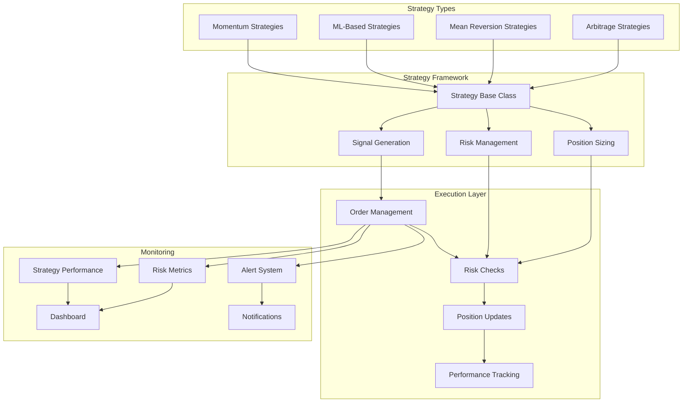

# Trading Strategies Documentation

## 📈 Overview

The trading strategies framework provides a modular, extensible system for implementing and managing different trading strategies. It supports both traditional quantitative strategies and ML-based approaches while maintaining consistent interfaces and risk management.

## 🏗️ Architecture

## 🎯 Strategy Types

### Momentum Strategies

#### Dual Momentum Strategy
**Purpose**: Capture trends by comparing asset performance to market and risk-free rate.

**Key Features**:
- **Relative Strength**: Compare asset performance to market
- **Absolute Momentum**: Ensure positive returns over risk-free rate
- **Rebalancing**: Monthly rebalancing based on momentum
- **Risk Management**: Stop-loss and position sizing

**Implementation**:
- **Lookback Period**: 12-month momentum calculation
- **Rebalancing**: Monthly portfolio rebalancing
- **Asset Universe**: Top 10 cryptocurrencies by market cap
- **Risk-Free Rate**: US Treasury bill rate

#### Cross-Asset Momentum
**Purpose**: Capture momentum across different asset classes and timeframes.

**Key Features**:
- **Multi-Asset**: Stocks, bonds, commodities, crypto
- **Multi-Timeframe**: Daily, weekly, monthly momentum
- **Momentum Ranking**: Rank assets by momentum
- **Dynamic Allocation**: Adjust allocation based on momentum

### ML-Based Strategies

#### LSTM Momentum Strategy
**Purpose**: Use deep learning to predict price movements and generate trading signals.

**Key Features**:
- **Sequence Learning**: Learn from historical price sequences
- **Feature Engineering**: Technical indicators and market data
- **Signal Generation**: Buy/sell/hold signals with confidence
- **Risk Management**: Position sizing based on confidence

**Model Architecture**:
- **Input**: 50-day price sequences with features
- **LSTM Layers**: 2-3 LSTM layers with dropout
- **Output**: Price direction prediction with confidence
- **Training**: Walk-forward validation with retraining

#### Ensemble Strategy
**Purpose**: Combine multiple ML models for improved performance and robustness.

**Key Features**:
- **Model Diversity**: Different model types (LSTM, LightGBM, etc.)
- **Ensemble Methods**: Voting, stacking, blending
- **Dynamic Weighting**: Adjust weights based on recent performance
- **Risk Management**: Diversified risk across models

### Mean Reversion Strategies

#### Bollinger Bands Strategy
**Purpose**: Trade mean reversion when prices deviate from moving averages.

**Key Features**:
- **Bollinger Bands**: Price channels based on standard deviation
- **Mean Reversion**: Buy oversold, sell overbought
- **Volatility Adjustment**: Adjust for market volatility
- **Trend Filter**: Only trade mean reversion in sideways markets

**Parameters**:
- **Period**: 20-day moving average
- **Standard Deviation**: 2 standard deviations
- **Entry Threshold**: 2.5 standard deviations
- **Exit Threshold**: 1 standard deviation

#### RSI Mean Reversion
**Purpose**: Trade mean reversion using RSI overbought/oversold signals.

**Key Features**:
- **RSI Calculation**: 14-day RSI calculation
- **Overbought/Oversold**: RSI > 70 (sell), RSI < 30 (buy)
- **Divergence Detection**: Price vs. RSI divergence
- **Trend Filter**: Only trade against trend in extreme conditions

## 🔧 Strategy Framework

### Base Strategy Class
**Purpose**: Common interface and functionality for all strategies.

**Key Methods**:
- `generate_signals()`: Generate trading signals
- `calculate_position_size()`: Calculate position size
- `update_positions()`: Update strategy positions
- `get_performance()`: Get strategy performance metrics

**Required Attributes**:
- `name`: Strategy name
- `symbols`: List of trading symbols
- `parameters`: Strategy parameters
- `risk_limits`: Risk management limits

### Signal Generation
**Purpose**: Convert market data and model predictions into trading signals.

**Signal Types**:
- **Directional**: Buy, sell, hold signals
- **Confidence**: Signal confidence level
- **Timing**: Entry and exit timing
- **Size**: Position size recommendations

**Signal Processing**:
- **Filtering**: Remove low-quality signals
- **Aggregation**: Combine multiple signal sources
- **Validation**: Ensure signals are valid
- **Persistence**: Track signal history

### Risk Management
**Purpose**: Manage risk across all strategies and positions.

**Risk Controls**:
- **Position Limits**: Maximum position size per symbol
- **Portfolio Limits**: Maximum portfolio exposure
- **Drawdown Limits**: Maximum allowed drawdown
- **Correlation Limits**: Maximum correlation between positions

**Risk Metrics**:
- **Value at Risk (VaR)**: Potential losses
- **Expected Shortfall**: Expected losses beyond VaR
- **Maximum Drawdown**: Largest peak-to-trough decline
- **Sharpe Ratio**: Risk-adjusted returns

### Position Sizing
**Purpose**: Calculate appropriate position sizes based on risk and confidence.

**Sizing Methods**:
- **Fixed Fractional**: Fixed percentage of portfolio
- **Kelly Criterion**: Optimal position size based on edge
- **Volatility Targeting**: Size based on asset volatility
- **Confidence Weighting**: Size based on signal confidence

**Risk Adjustment**:
- **Volatility Adjustment**: Adjust for asset volatility
- **Correlation Adjustment**: Adjust for portfolio correlation
- **Liquidity Adjustment**: Adjust for market liquidity
- **Regime Adjustment**: Adjust for market regime

## 📊 Strategy Performance

### Performance Metrics
- **Total Return**: Absolute return over period
- **Annualized Return**: Return annualized
- **Volatility**: Standard deviation of returns
- **Sharpe Ratio**: Risk-adjusted return
- **Maximum Drawdown**: Largest peak-to-trough decline
- **Win Rate**: Percentage of profitable trades
- **Profit Factor**: Gross profit / gross loss
- **Calmar Ratio**: Annual return / max drawdown

### Risk Metrics
- **Value at Risk (VaR)**: Potential losses at confidence level
- **Expected Shortfall**: Expected losses beyond VaR
- **Tail Risk**: Risk of extreme losses
- **Correlation Risk**: Risk from correlated positions
- **Liquidity Risk**: Risk from illiquid positions

### Attribution Analysis
- **Factor Attribution**: Performance attribution to factors
- **Strategy Attribution**: Performance attribution to strategies
- **Time Attribution**: Performance attribution to time periods
- **Asset Attribution**: Performance attribution to assets

## 🔍 Strategy Monitoring

### Real-Time Monitoring
- **Position Tracking**: Monitor current positions
- **P&L Tracking**: Track profit and loss
- **Risk Monitoring**: Monitor risk metrics
- **Signal Quality**: Monitor signal quality and accuracy

### Performance Analysis
- **Historical Performance**: Analyze past performance
- **Performance Attribution**: Understand performance drivers
- **Risk Analysis**: Analyze risk characteristics
- **Benchmark Comparison**: Compare to benchmarks

### Alert System
- **Performance Alerts**: Alert on performance changes
- **Risk Alerts**: Alert on risk limit breaches
- **Signal Alerts**: Alert on signal quality issues
- **System Alerts**: Alert on system issues

## 🚨 Risk Management

### Position Limits
- **Symbol Limits**: Maximum position per symbol
- **Sector Limits**: Maximum exposure per sector
- **Currency Limits**: Maximum exposure per currency
- **Leverage Limits**: Maximum leverage allowed

### Portfolio Limits
- **Total Exposure**: Maximum total portfolio exposure
- **Correlation Limits**: Maximum correlation between positions
- **Concentration Limits**: Maximum concentration in single asset
- **Liquidity Limits**: Minimum liquidity requirements

### Drawdown Management
- **Drawdown Limits**: Maximum allowed drawdown
- **Drawdown Alerts**: Alert on drawdown thresholds
- **Recovery Plans**: Plans for drawdown recovery
- **Stop-Loss Rules**: Automatic position closure rules

## 🔧 Configuration

### Strategy Parameters
- **Lookback Periods**: Historical data periods
- **Rebalancing Frequency**: How often to rebalance
- **Signal Thresholds**: Minimum signal strength
- **Risk Parameters**: Risk management parameters

### Risk Parameters
- **Position Limits**: Maximum position sizes
- **Portfolio Limits**: Maximum portfolio exposure
- **Drawdown Limits**: Maximum drawdown allowed
- **Correlation Limits**: Maximum correlation allowed

### Monitoring Parameters
- **Alert Thresholds**: Alert trigger levels
- **Reporting Frequency**: How often to report
- **Performance Metrics**: Which metrics to track
- **Risk Metrics**: Which risk metrics to monitor

## 🔮 Future Enhancements

### Advanced Strategies
- **Multi-Asset Strategies**: Strategies across asset classes
- **Options Strategies**: Options-based strategies
- **Arbitrage Strategies**: Cross-exchange arbitrage
- **Market Making**: Market making strategies

### Risk Management
- **Dynamic Risk Management**: Adaptive risk limits
- **Stress Testing**: Regular stress testing
- **Scenario Analysis**: What-if scenario analysis
- **Monte Carlo Simulation**: Monte Carlo risk analysis

### Performance Optimization
- **Strategy Optimization**: Optimize strategy parameters
- **Portfolio Optimization**: Optimize portfolio allocation
- **Transaction Cost Optimization**: Minimize transaction costs
- **Tax Optimization**: Optimize for tax efficiency

## 📚 Related Documentation

- [Model Training](model_training.md) - How ML models are trained
- [Backtesting](backtesting.md) - How strategies are validated
- [Risk Management](risk_management.md) - Risk management framework
- [Development Plan](../development_plan.md) - Implementation timeline
