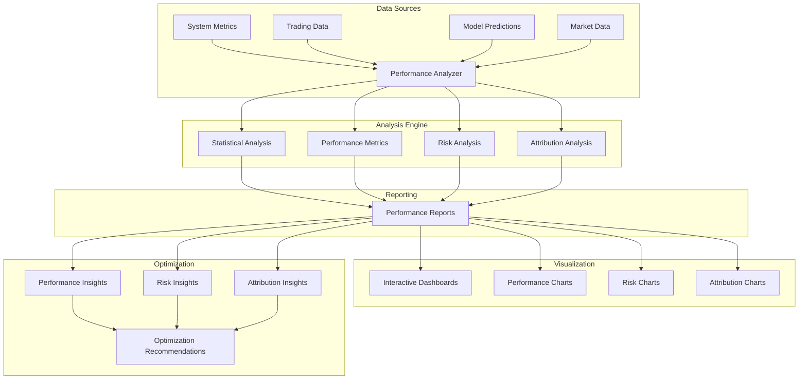

# Performance Analysis Documentation

## 📊 Overview

The performance analysis framework provides comprehensive analysis of system performance, trading strategy performance, and model performance. It focuses on providing actionable insights for optimization and decision-making.

## 🏗️ Architecture

## 📈 Performance Metrics

### System Performance
**Purpose**: Monitor and analyze system performance characteristics.

**Key Metrics**:
- **Response Time**: API response latency
- **Throughput**: Requests per second
- **Error Rate**: Percentage of failed requests
- **Availability**: System uptime percentage
- **Resource Usage**: CPU, memory, disk usage

**Performance Targets**:
- **Response Time**: < 100ms for 95% of requests
- **Throughput**: > 1000 requests per second
- **Error Rate**: < 0.1% of requests
- **Availability**: > 99.9% uptime
- **Resource Usage**: < 80% of capacity

### Trading Performance
**Purpose**: Analyze trading strategy and portfolio performance.

**Return Metrics**:
- **Total Return**: Absolute return over period
- **Annualized Return**: Return annualized
- **Excess Return**: Return above benchmark
- **Risk-Adjusted Return**: Return per unit of risk
- **Compound Annual Growth Rate (CAGR)**: Annualized growth rate

**Risk Metrics**:
- **Volatility**: Standard deviation of returns
- **Sharpe Ratio**: Risk-adjusted return
- **Sortino Ratio**: Downside risk-adjusted return
- **Calmar Ratio**: Return to max drawdown ratio
- **Information Ratio**: Active return to tracking error

**Drawdown Metrics**:
- **Maximum Drawdown**: Largest peak-to-trough decline
- **Average Drawdown**: Average drawdown over period
- **Drawdown Duration**: Time to recover from drawdown
- **Underwater Periods**: Time spent below previous peak
- **Recovery Time**: Time to recover from drawdown

### Model Performance
**Purpose**: Analyze machine learning model performance.

**Accuracy Metrics**:
- **Accuracy**: Percentage of correct predictions
- **Precision**: True positives / (True positives + False positives)
- **Recall**: True positives / (True positives + False negatives)
- **F1-Score**: Harmonic mean of precision and recall
- **AUC-ROC**: Area under ROC curve

**Financial Metrics**:
- **Hit Rate**: Percentage of profitable predictions
- **Average Win**: Average profit per winning trade
- **Average Loss**: Average loss per losing trade
- **Profit Factor**: Gross profit / Gross loss
- **Expectancy**: Expected value per trade

## 🔍 Risk Analysis

### Risk Metrics
**Purpose**: Comprehensive risk assessment and monitoring.

**Value at Risk (VaR)**:
- **Historical VaR**: VaR based on historical returns
- **Parametric VaR**: VaR based on normal distribution
- **Monte Carlo VaR**: VaR based on Monte Carlo simulation
- **Conditional VaR**: Expected loss beyond VaR
- **Expected Shortfall**: Average loss beyond VaR

**Risk Decomposition**:
- **Systematic Risk**: Market risk that cannot be diversified
- **Unsystematic Risk**: Specific risk that can be diversified
- **Factor Risk**: Risk from exposure to risk factors
- **Idiosyncratic Risk**: Asset-specific risk
- **Liquidity Risk**: Risk from illiquid positions

### Stress Testing
**Purpose**: Test portfolio performance under extreme scenarios.

**Scenario Types**:
- **Historical Scenarios**: Past market crises
- **Hypothetical Scenarios**: Custom stress scenarios
- **Monte Carlo Scenarios**: Random scenario generation
- **Regime Scenarios**: Different market regimes
- **Correlation Scenarios**: Correlation breakdown scenarios

**Stress Test Metrics**:
- **Scenario Returns**: Returns under stress scenarios
- **Scenario Drawdowns**: Drawdowns under stress scenarios
- **Scenario VaR**: VaR under stress scenarios
- **Scenario Losses**: Losses under stress scenarios
- **Recovery Analysis**: Recovery from stress scenarios

## 📊 Attribution Analysis

### Performance Attribution
**Purpose**: Understand what drives performance.

**Factor Attribution**:
- **Market Factor**: Performance from market movements
- **Size Factor**: Performance from size exposure
- **Value Factor**: Performance from value exposure
- **Momentum Factor**: Performance from momentum exposure
- **Volatility Factor**: Performance from volatility exposure
- **Currency Factor**: Performance from currency exposure

**Strategy Attribution**:
- **Strategy Allocation**: Performance from strategy allocation
- **Strategy Selection**: Performance from strategy selection
- **Strategy Interaction**: Performance from strategy interactions
- **Timing**: Performance from timing decisions
- **Rebalancing**: Performance from rebalancing decisions

**Asset Attribution**:
- **Asset Allocation**: Performance from asset allocation
- **Asset Selection**: Performance from asset selection
- **Asset Interaction**: Performance from asset interactions
- **Sector Allocation**: Performance from sector allocation
- **Geographic Allocation**: Performance from geographic allocation

### Risk Attribution
**Purpose**: Understand what drives risk.

**Risk Factor Attribution**:
- **Market Risk**: Risk from market exposure
- **Factor Risk**: Risk from factor exposure
- **Idiosyncratic Risk**: Risk from specific assets
- **Currency Risk**: Risk from currency exposure
- **Liquidity Risk**: Risk from illiquid positions

**Portfolio Risk Attribution**:
- **Concentration Risk**: Risk from concentration
- **Correlation Risk**: Risk from correlations
- **Leverage Risk**: Risk from leverage
- **Timing Risk**: Risk from timing decisions
- **Model Risk**: Risk from model errors

## 🔧 Performance Optimization

### System Optimization
**Purpose**: Optimize system performance and efficiency.

**Optimization Areas**:
- **Response Time**: Reduce API response latency
- **Throughput**: Increase request processing capacity
- **Resource Usage**: Optimize CPU, memory, disk usage
- **Scalability**: Improve system scalability
- **Efficiency**: Improve processing efficiency

**Optimization Techniques**:
- **Caching**: Implement effective caching strategies
- **Parallel Processing**: Use parallel processing where possible
- **Database Optimization**: Optimize database queries
- **Code Optimization**: Optimize code performance
- **Infrastructure Optimization**: Optimize infrastructure setup

### Trading Optimization
**Purpose**: Optimize trading strategy performance.

**Optimization Areas**:
- **Strategy Parameters**: Optimize strategy parameters
- **Position Sizing**: Optimize position sizing
- **Risk Management**: Optimize risk management
- **Rebalancing**: Optimize rebalancing frequency
- **Transaction Costs**: Minimize transaction costs

**Optimization Techniques**:
- **Parameter Optimization**: Optimize strategy parameters
- **Portfolio Optimization**: Optimize portfolio allocation
- **Risk Optimization**: Optimize risk-return trade-off
- **Cost Optimization**: Minimize transaction costs
- **Tax Optimization**: Optimize for tax efficiency

### Model Optimization
**Purpose**: Optimize machine learning model performance.

**Optimization Areas**:
- **Feature Engineering**: Optimize feature creation
- **Model Selection**: Optimize model selection
- **Hyperparameter Tuning**: Optimize hyperparameters
- **Ensemble Methods**: Optimize ensemble strategies
- **Validation**: Optimize validation strategies

**Optimization Techniques**:
- **Feature Selection**: Select optimal features
- **Model Tuning**: Tune model parameters
- **Ensemble Optimization**: Optimize ensemble methods
- **Cross-Validation**: Optimize validation strategies
- **Regularization**: Optimize regularization parameters

## 📈 Performance Reporting

### Automated Reports
**Purpose**: Generate regular performance reports.

**Report Types**:
- **Daily Reports**: Daily performance summary
- **Weekly Reports**: Weekly performance analysis
- **Monthly Reports**: Monthly performance review
- **Quarterly Reports**: Quarterly performance assessment
- **Annual Reports**: Annual performance evaluation

**Report Contents**:
- **Performance Summary**: Key performance metrics
- **Risk Analysis**: Risk metrics and analysis
- **Attribution Analysis**: Performance attribution
- **Optimization Recommendations**: Improvement suggestions
- **Benchmark Comparison**: Performance vs. benchmarks

### Interactive Dashboards
**Purpose**: Provide interactive performance analysis.

**Dashboard Features**:
- **Real-Time Monitoring**: Live performance monitoring
- **Historical Analysis**: Historical performance analysis
- **Interactive Charts**: Interactive performance charts
- **Drill-Down Analysis**: Detailed performance analysis
- **Export Functionality**: Export data and charts

**Dashboard Sections**:
- **Performance Overview**: Overall performance metrics
- **Risk Analysis**: Risk metrics and analysis
- **Attribution Analysis**: Performance attribution
- **Optimization Insights**: Optimization recommendations
- **Benchmark Comparison**: Performance vs. benchmarks

## 🔍 Performance Monitoring

### Real-Time Monitoring
**Purpose**: Monitor performance in real-time.

**Monitoring Areas**:
- **System Performance**: Real-time system metrics
- **Trading Performance**: Real-time trading metrics
- **Model Performance**: Real-time model metrics
- **Risk Metrics**: Real-time risk monitoring
- **Alert Status**: Real-time alert monitoring

**Monitoring Tools**:
- **Grafana Dashboards**: Real-time metric visualization
- **Streamlit Dashboard**: Interactive business intelligence
- **Alert Manager**: Real-time alert management
- **Log Analysis**: Real-time log analysis

### Historical Analysis
**Purpose**: Analyze historical performance trends.

**Analysis Areas**:
- **Performance Trends**: Long-term performance trends
- **Risk Trends**: Long-term risk trends
- **Attribution Trends**: Long-term attribution trends
- **Optimization Trends**: Long-term optimization trends
- **Benchmark Trends**: Long-term benchmark comparison

**Analysis Tools**:
- **Grafana**: Historical metric analysis
- **Streamlit**: Interactive historical analysis
- **Custom Reports**: Automated report generation
- **Data Export**: Export data for external analysis

## 🔧 Configuration

### Performance Configuration
- **Metric Collection**: Which metrics to collect
- **Analysis Frequency**: How often to analyze
- **Report Generation**: When to generate reports
- **Alert Thresholds**: Alert trigger levels

### Optimization Configuration
- **Optimization Targets**: What to optimize
- **Optimization Methods**: How to optimize
- **Optimization Constraints**: Optimization limits
- **Optimization Frequency**: How often to optimize

### Reporting Configuration
- **Report Types**: Which reports to generate
- **Report Frequency**: How often to generate reports
- **Report Recipients**: Who receives reports
- **Report Format**: Report format and delivery

## 🔮 Future Enhancements

### Advanced Analytics
- **Machine Learning Analytics**: ML-based performance analysis
- **Predictive Analytics**: Predict future performance
- **Anomaly Detection**: Detect performance anomalies
- **Pattern Recognition**: Recognize performance patterns

### Optimization Improvements
- **Automated Optimization**: Automated performance optimization
- **Dynamic Optimization**: Real-time optimization
- **Multi-Objective Optimization**: Optimize multiple objectives
- **Constraint Optimization**: Optimization with constraints

### Reporting Improvements
- **Interactive Reports**: More interactive reports
- **Custom Reports**: Custom report generation
- **Real-Time Reports**: Real-time report generation
- **Mobile Reports**: Mobile-friendly reports

## 📚 Related Documentation

- [Monitoring](components/monitoring.md) - System monitoring
- [Trading Strategies](components/trading_strategies.md) - Strategy performance
- [Backtesting](components/backtesting.md) - Backtesting performance
- [Development Plan](development_plan.md) - Implementation timeline
